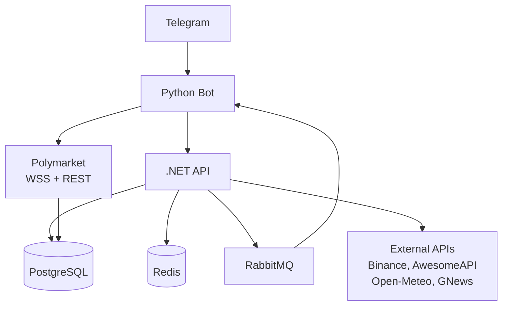

# Personal Hub — Development Roadmap

> **How to use this document:** Follow each phase in order. Do not skip steps. Every task has a clear definition of done (DoD). Tests are not optional — write them as you build. At the end of each phase there is a mandatory validation checklist before moving on.
>
> **Read `ARCHITECTURE.md` before starting any phase.**

---

## Table of Contents

- [Prerequisites](#prerequisites)
- [Phase 0 — Environment Setup](#phase-0--environment-setup)
- [Phase 1 — Repository & Infrastructure Base](#phase-1--repository--infrastructure-base)
- [Phase 2 — .NET Foundation: Bills CRUD](#phase-2--net-foundation-bills-crud)
- [Phase 3 — Python Bot Foundation](#phase-3--python-bot-foundation)
- [Phase 4 — Market & Weather Aggregation](#phase-4--market--weather-aggregation)
- [Phase 5 — Morning Report](#phase-5--morning-report)
- [Phase 6 — Alerts & RabbitMQ Messaging](#phase-6--alerts--rabbitmq-messaging)
- [Phase 7 — Polymarket Tracker](#phase-7--polymarket-tracker)
- [Phase 8 — Testing & Quality](#phase-8--testing--quality)
- [Phase 9 — VPS Deploy & CI/CD](#phase-9--vps-deploy--cicd)
- [Phase 10 — Final Polish & GitHub Portfolio](#phase-10--final-polish--github-portfolio)

---

## Prerequisites

Before writing a single line of code, make sure everything below is installed and working on your local machine.

### Required Tools

| Tool | Version | Install |
|---|---|---|
| .NET SDK | 8.x | https://dotnet.microsoft.com/download |
| Python | 3.12.x | https://www.python.org/downloads |
| Docker Desktop | Latest | https://www.docker.com/products/docker-desktop |
| Git | 2.x+ | https://git-scm.com |
| VS Code or Rider | Latest | Your preference |
| DBeaver or TablePlus | Latest | PostgreSQL GUI client |
| Postman or Bruno | Latest | API testing |

### Required Accounts (free)

| Service | Purpose | URL |
|---|---|---|
| GitHub | Source code + CI/CD | github.com |
| Telegram | Create bot via @BotFather | telegram.org |
| Alpha Vantage | Stock/ETF API key | alphavantage.co |
| OpenWeatherMap | Weather API key | openweathermap.org |
| GNews | News API key | gnews.io |
| NewsAPI | News API key | newsapi.org |
| Polymarket | CLOB API credentials | polymarket.com |

### Pre-flight Checks

Run these before starting. If any fails, fix it before continuing.

```bash
dotnet --version      # must show 8.x.x
python --version      # must show 3.12.x
docker --version      # must show 20+
docker compose version # must show 2.x
git --version
```

---

## Phase 0 — Environment Setup

**Goal:** Local machine ready, all tools configured, accounts verified.

**Estimated time:** 2–3 hours

### 0.1 — Telegram Bot Setup

1. Open Telegram and search for `@BotFather`
2. Send `/newbot` and follow the prompts
3. Save the **bot token** securely — you'll use it as `TELEGRAM_BOT_TOKEN`
4. Send `/start` to your new bot
5. Get your personal **chat ID**:
   - Visit `https://api.telegram.org/bot<YOUR_TOKEN>/getUpdates` in the browser
   - Send any message to your bot
   - Refresh the URL and copy the `"id"` field from `"chat"` — this is `TELEGRAM_CHAT_ID`

### 0.2 — API Keys

Register and save keys for each service listed in prerequisites. Store them temporarily in a local notepad — you'll move them to `.env` in Phase 1.

### 0.3 — Polymarket CLOB Credentials

1. Log in to polymarket.com
2. Go to Settings → API Keys
3. Create a new API key set — save **API Key**, **Secret**, and **Passphrase**
4. Copy your wallet address (starts with `0x`)

### 0.4 — Git Global Config

```bash
git config --global user.name "Your Name"
git config --global user.email "your@email.com"
git config --global init.defaultBranch main
```

---

## Phase 1 — Repository & Infrastructure Base

**Goal:** Monorepo created, Docker Compose running all infrastructure services, `.env` configured.

**Estimated time:** 3–4 hours

**Branch:** `chore/project-setup`

### 1.1 — Create GitHub Repository

1. Create a new **public** repository on GitHub named `personal-hub`
2. Clone it locally:

```bash
git clone https://github.com/YOUR_USERNAME/personal-hub.git
cd personal-hub
```

### 1.2 — Create the Monorepo Structure

Create the top-level structure manually:

```bash
mkdir -p src/AssistantAPI
mkdir -p src/TelegramBot
mkdir -p infra/nginx
mkdir -p infra/scripts
mkdir -p .github/workflows
```

### 1.3 — Create `.env.example` and `.env`

Create `.env.example` at the repo root with all variables from ARCHITECTURE.md Section 5. Then copy it to `.env` and fill in your real values:

```bash
cp .env.example .env
```

**Never commit `.env`.** Add it to `.gitignore` immediately:

```bash
# .gitignore (root)
.env
*.user
bin/
obj/
__pycache__/
*.pyc
.venv/
node_modules/
.DS_Store
```

### 1.4 — Create `docker-compose.yml`

Create the full `docker-compose.yml` at the repo root as specified in ARCHITECTURE.md Section 4. At this stage, the `api` and `bot` services will not yet build (no source code), so comment them out temporarily:

```yaml
# src/AssistantAPI and src/TelegramBot not yet created — uncomment when ready
# api:
#   build: ./src/AssistantAPI
# bot:
#   build: ./src/TelegramBot

services:
  postgres:
    image: postgres:16-alpine
    container_name: assistant-postgres
    ports:
      - "5432:5432"     # expose locally for dev tools
    volumes:
      - postgres_data:/var/lib/postgresql/data
    environment:
      - POSTGRES_DB=${POSTGRES_DB}
      - POSTGRES_USER=${POSTGRES_USER}
      - POSTGRES_PASSWORD=${POSTGRES_PASSWORD}
    networks:
      - assistant-net
    healthcheck:
      test: ["CMD-SHELL", "pg_isready -U ${POSTGRES_USER}"]
      interval: 10s
      timeout: 5s
      retries: 5

  redis:
    image: redis:7-alpine
    container_name: assistant-redis
    ports:
      - "6379:6379"     # expose locally for dev tools
    command: redis-server --appendonly yes
    volumes:
      - redis_data:/data
    networks:
      - assistant-net
    healthcheck:
      test: ["CMD", "redis-cli", "ping"]
      interval: 10s
      timeout: 5s
      retries: 5

  rabbitmq:
    image: rabbitmq:3-management-alpine
    container_name: assistant-rabbitmq
    ports:
      - "5672:5672"
      - "15672:15672"
    volumes:
      - rabbitmq_data:/var/lib/rabbitmq
    environment:
      - RABBITMQ_DEFAULT_USER=${RABBITMQ_USER}
      - RABBITMQ_DEFAULT_PASS=${RABBITMQ_PASSWORD}
    networks:
      - assistant-net
    healthcheck:
      test: rabbitmq-diagnostics -q ping
      interval: 15s
      timeout: 10s
      retries: 5

volumes:
  postgres_data:
  redis_data:
  rabbitmq_data:

networks:
  assistant-net:
    driver: bridge
```

### 1.5 — Start and Verify Infrastructure

```bash
docker compose up -d
docker compose ps        # all 3 should show "healthy" or "running"
```

Verify each service:

```bash
# PostgreSQL
docker exec -it assistant-postgres psql -U assistant -d assistant_db -c "\l"

# Redis
docker exec -it assistant-redis redis-cli ping
# Expected: PONG

# RabbitMQ
# Open http://localhost:15672 in browser
# Login: guest / guest (or your configured user)
# You should see the management dashboard
```

### 1.6 — Commit

```bash
git add .
git commit -m "chore: project setup — monorepo structure, docker-compose, gitignore"
git push origin chore/project-setup
```

Open a Pull Request on GitHub and merge into `main`.

### ✅ Phase 1 Checklist

- [ ] GitHub repository created and cloned
- [ ] Folder structure matches ARCHITECTURE.md Section 3
- [ ] `.env.example` committed, `.env` is in `.gitignore` and never committed
- [ ] `docker compose up -d` starts Postgres, Redis, RabbitMQ without errors
- [ ] All 3 containers show healthy status
- [ ] RabbitMQ management UI accessible at `http://localhost:15672`
- [ ] Connected to Postgres via DBeaver/TablePlus without errors

---

## Phase 2 — .NET Foundation: Bills CRUD

**Goal:** Full working .NET 8 API with `Bill` domain, EF Core migrations, repository pattern, service layer, endpoints, validation, and unit tests.

**Estimated time:** 6–8 hours

**Branch:** `feat/dotnet-foundation`

### 2.1 — Create the .NET Solution

```bash
cd src/AssistantAPI
dotnet new sln -n AssistantAPI
dotnet new webapi -n AssistantAPI --no-openapi -f net8.0
dotnet new xunit -n AssistantAPI.Tests
dotnet sln add AssistantAPI/AssistantAPI.csproj
dotnet sln add AssistantAPI.Tests/AssistantAPI.Tests.csproj
dotnet add AssistantAPI.Tests/AssistantAPI.Tests.csproj reference AssistantAPI/AssistantAPI.csproj
```

### 2.2 — Install NuGet Packages

```bash
cd AssistantAPI

# Core
dotnet add package Microsoft.EntityFrameworkCore --version 8.*
dotnet add package Npgsql.EntityFrameworkCore.PostgreSQL --version 8.*
dotnet add package Microsoft.EntityFrameworkCore.Design --version 8.*

# Cache
dotnet add package StackExchange.Redis --version 2.*

# Messaging
dotnet add package MassTransit.RabbitMQ --version 8.*

# Scheduling
dotnet add package Hangfire.AspNetCore --version 1.*
dotnet add package Hangfire.PostgreSql --version 1.*

# Logging
dotnet add package Serilog.AspNetCore --version 8.*
dotnet add package Serilog.Sinks.Console --version 5.*

# Validation
dotnet add package FluentValidation.AspNetCore --version 11.*

# Resilience
dotnet add package Microsoft.Extensions.Http.Polly --version 8.*

# Auth
dotnet add package Microsoft.AspNetCore.Authentication.JwtBearer --version 8.*

# Test packages (in Tests project)
cd ../AssistantAPI.Tests
dotnet add package Moq --version 4.*
dotnet add package FluentAssertions --version 6.*
dotnet add package Microsoft.EntityFrameworkCore.InMemory --version 8.*
```

### 2.3 — Clean Up Default Files

Remove the default `WeatherForecast.cs` and `Controllers/` folder if created. Set up `Program.cs` as a minimal skeleton:

```csharp
// Program.cs
var builder = WebApplication.CreateBuilder(args);
var app = builder.Build();
app.MapGet("/health", () => Results.Ok(new { status = "healthy", timestamp = DateTime.UtcNow }));
app.Run();
```

Run `dotnet run` — it should start on port 5000 and `GET /health` should return 200.

### 2.4 — Implement Domain Layer

Create the following files under `AssistantAPI/Domain/`:

**`Entities/Bill.cs`**
```csharp
public class Bill
{
    public Guid Id { get; private set; } = Guid.NewGuid();
    public string Name { get; set; } = string.Empty;
    public decimal Amount { get; set; }
    public DateOnly DueDate { get; set; }
    public BillStatus Status { get; set; } = BillStatus.Pending;
    public DateTime? PaidAt { get; set; }
    public string? Notes { get; set; }
    public DateTime CreatedAt { get; private set; } = DateTime.UtcNow;
    public DateTime UpdatedAt { get; set; } = DateTime.UtcNow;

    public bool IsOverdue => Status == BillStatus.Pending && DueDate < DateOnly.FromDateTime(DateTime.UtcNow);
    public int DaysUntilDue => DueDate.DayNumber - DateOnly.FromDateTime(DateTime.UtcNow).DayNumber;

    public void MarkAsPaid()
    {
        Status = BillStatus.Paid;
        PaidAt = DateTime.UtcNow;
        UpdatedAt = DateTime.UtcNow;
    }
}
```

**`Enums/BillStatus.cs`**
```csharp
public enum BillStatus { Pending, Paid, Overdue }
```

**`Interfaces/IBillRepository.cs`**
```csharp
public interface IBillRepository
{
    Task<IEnumerable<Bill>> GetAllAsync(BillStatus? status = null);
    Task<Bill?> GetByIdAsync(Guid id);
    Task<Bill> CreateAsync(Bill bill);
    Task<Bill> UpdateAsync(Bill bill);
    Task DeleteAsync(Guid id);
}
```

### 2.5 — Implement Infrastructure Layer

**`Infrastructure/Data/AppDbContext.cs`**
```csharp
public class AppDbContext : DbContext
{
    public AppDbContext(DbContextOptions<AppDbContext> options) : base(options) { }

    public DbSet<Bill> Bills => Set<Bill>();

    protected override void OnModelCreating(ModelBuilder modelBuilder)
    {
        modelBuilder.Entity<Bill>(e => {
            e.HasKey(b => b.Id);
            e.Property(b => b.Name).HasMaxLength(255).IsRequired();
            e.Property(b => b.Amount).HasPrecision(10, 2);
            e.Property(b => b.Status).HasConversion<string>();
        });
    }
}
```

**`Infrastructure/Data/Repositories/BillRepository.cs`**

Implement all methods of `IBillRepository` using EF Core. Use `AsNoTracking()` for reads. The `GetAllAsync` method should filter by status when provided and automatically mark overdue bills.

### 2.6 — Implement Application Layer

**`Application/DTOs/BillDto.cs`** — request and response records:
```csharp
public record CreateBillRequest(string Name, decimal Amount, DateOnly DueDate, string? Notes);
public record UpdateBillRequest(string Name, decimal Amount, DateOnly DueDate, string? Notes);
public record BillResponse(Guid Id, string Name, decimal Amount, DateOnly DueDate,
    string Status, DateTime? PaidAt, string? Notes, bool IsOverdue, int DaysUntilDue);
public record BillListResponse(IEnumerable<BillResponse> Data, BillSummary Summary);
public record BillSummary(int TotalPending, int TotalOverdue, decimal TotalAmountDue);
```

**`Application/Validators/BillValidator.cs`**
```csharp
public class CreateBillRequestValidator : AbstractValidator<CreateBillRequest>
{
    public CreateBillRequestValidator()
    {
        RuleFor(x => x.Name).NotEmpty().MaximumLength(255);
        RuleFor(x => x.Amount).GreaterThan(0);
        RuleFor(x => x.DueDate).GreaterThanOrEqualTo(DateOnly.FromDateTime(DateTime.UtcNow));
    }
}
```

**`Application/Services/BillService.cs`**

Implement:
- `GetAllAsync(BillStatus? status)` — returns `BillListResponse` with summary
- `GetByIdAsync(Guid id)` — returns `BillResponse` or null
- `CreateAsync(CreateBillRequest request)` — validates, creates, returns `BillResponse`
- `UpdateAsync(Guid id, UpdateBillRequest request)` — validates, updates, returns `BillResponse`
- `MarkAsPaidAsync(Guid id)` — calls `bill.MarkAsPaid()`, saves
- `DeleteAsync(Guid id)` — deletes if exists

### 2.7 — Implement API Endpoints

**`Api/Endpoints/BillEndpoints.cs`**

```csharp
public static class BillEndpoints
{
    public static void MapBillEndpoints(this WebApplication app)
    {
        var group = app.MapGroup("/api/bills").WithTags("Bills");

        group.MapGet("/", async (IBillService svc, [FromQuery] string? status) => {
            var statusEnum = status != null ? Enum.Parse<BillStatus>(status, true) : (BillStatus?)null;
            return Results.Ok(await svc.GetAllAsync(statusEnum));
        });

        group.MapGet("/{id:guid}", async (IBillService svc, Guid id) => {
            var bill = await svc.GetByIdAsync(id);
            return bill is null ? Results.NotFound() : Results.Ok(bill);
        });

        group.MapPost("/", async (IBillService svc, IValidator<CreateBillRequest> validator,
            CreateBillRequest request) => {
            var validation = await validator.ValidateAsync(request);
            if (!validation.IsValid)
                return Results.ValidationProblem(validation.ToDictionary());
            var bill = await svc.CreateAsync(request);
            return Results.Created($"/api/bills/{bill.Id}", bill);
        });

        group.MapPut("/{id:guid}", async (IBillService svc, Guid id, UpdateBillRequest request) => {
            var bill = await svc.UpdateAsync(id, request);
            return bill is null ? Results.NotFound() : Results.Ok(bill);
        });

        group.MapPatch("/{id:guid}/pay", async (IBillService svc, Guid id) => {
            var bill = await svc.MarkAsPaidAsync(id);
            return bill is null ? Results.NotFound() : Results.Ok(bill);
        });

        group.MapDelete("/{id:guid}", async (IBillService svc, Guid id) => {
            var deleted = await svc.DeleteAsync(id);
            return deleted ? Results.NoContent() : Results.NotFound();
        });
    }
}
```

### 2.8 — Wire Up `Program.cs`

```csharp
// Program.cs
using Serilog;

Log.Logger = new LoggerConfiguration()
    .WriteTo.Console()
    .CreateLogger();

var builder = WebApplication.CreateBuilder(args);
builder.Host.UseSerilog();

// Database
builder.Services.AddDbContext<AppDbContext>(opt =>
    opt.UseNpgsql(builder.Configuration.GetConnectionString("Postgres")));

// DI
builder.Services.AddScoped<IBillRepository, BillRepository>();
builder.Services.AddScoped<IBillService, BillService>();
builder.Services.AddValidatorsFromAssemblyContaining<CreateBillRequestValidator>();

var app = builder.Build();

app.UseExceptionHandler("/error");
app.Map("/error", () => Results.Problem());

app.MapGet("/health", () => Results.Ok(new { status = "healthy" }));
app.MapBillEndpoints();

// Auto-migrate on startup (dev only — use proper migration strategy in prod)
using (var scope = app.Services.CreateScope())
{
    var db = scope.ServiceProvider.GetRequiredService<AppDbContext>();
    db.Database.Migrate();
}

app.Run();
```

### 2.9 — Create and Run EF Core Migration

```bash
cd src/AssistantAPI/AssistantAPI

# Make sure Postgres is running (docker compose up -d postgres)
dotnet ef migrations add InitialCreate --output-dir Infrastructure/Data/Migrations
dotnet ef database update
```

Verify in DBeaver/TablePlus that the `bills` table was created.

### 2.10 — Add `Dockerfile` for AssistantAPI

```dockerfile
# src/AssistantAPI/Dockerfile
FROM mcr.microsoft.com/dotnet/sdk:8.0 AS build
WORKDIR /src
COPY AssistantAPI/AssistantAPI.csproj AssistantAPI/
RUN dotnet restore AssistantAPI/AssistantAPI.csproj
COPY . .
RUN dotnet publish AssistantAPI/AssistantAPI.csproj -c Release -o /app/publish

FROM mcr.microsoft.com/dotnet/aspnet:8.0 AS final
WORKDIR /app
COPY --from=build /app/publish .
EXPOSE 5000
ENV ASPNETCORE_URLS=http://+:5000
ENTRYPOINT ["dotnet", "AssistantAPI.dll"]
```

### 2.11 — Unit Tests for Bill Domain

Create tests in `AssistantAPI.Tests/Unit/`:

**`BillTests.cs`** — test the entity:
- `Bill_MarkAsPaid_ShouldSetStatusAndPaidAt`
- `Bill_IsOverdue_ShouldReturnTrue_WhenPendingAndDueDatePast`
- `Bill_IsOverdue_ShouldReturnFalse_WhenPaid`
- `Bill_DaysUntilDue_ShouldReturnCorrectValue`

**`BillServiceTests.cs`** — test the service using Moq:
- `GetAllAsync_ShouldReturnBillListResponse_WithCorrectSummary`
- `CreateAsync_ShouldCallRepository_AndReturnDto`
- `MarkAsPaidAsync_ShouldReturnNull_WhenBillNotFound`
- `MarkAsPaidAsync_ShouldMarkBillAsPaid_WhenFound`
- `DeleteAsync_ShouldReturnFalse_WhenNotFound`

**`BillValidatorTests.cs`**:
- `CreateBillRequest_ShouldFail_WhenNameIsEmpty`
- `CreateBillRequest_ShouldFail_WhenAmountIsZero`
- `CreateBillRequest_ShouldFail_WhenDueDateIsInThePast`
- `CreateBillRequest_ShouldPass_WithValidData`

Run all tests:
```bash
cd src/AssistantAPI
dotnet test
# All tests must pass before continuing
```

### 2.12 — Manual API Test

With `docker compose up -d postgres` and `dotnet run` running:

```bash
# Create a bill
curl -X POST http://localhost:5000/api/bills \
  -H "Content-Type: application/json" \
  -d '{"name":"Internet","amount":99.90,"due_date":"2026-06-01","notes":"Vivo"}'

# List bills
curl http://localhost:5000/api/bills

# Mark as paid (use the id from the create response)
curl -X PATCH http://localhost:5000/api/bills/{id}/pay
```

### 2.13 — Commit

```bash
git add .
git commit -m "feat: .NET bills CRUD — domain, service, endpoints, migrations, unit tests"
git push origin feat/dotnet-foundation
```

Open PR → merge into `main`.

### ✅ Phase 2 Checklist

- [ ] `dotnet build` runs with 0 errors and 0 warnings
- [ ] `dotnet test` passes 100% (minimum 12 tests)
- [ ] `dotnet ef database update` creates the `bills` table in Postgres
- [ ] All 6 bill endpoints return correct HTTP status codes
- [ ] Validation returns 400 with `ValidationProblem` for invalid input
- [ ] `GET /health` returns 200
- [ ] Dockerfile builds successfully: `docker build -t assistant-api ./src/AssistantAPI`

---

## Phase 3 — Python Bot Foundation

**Goal:** Python virtual environment, project structure, Telegram bot running, `api_client.py` calling the .NET API, `/bills` command working end-to-end.

**Estimated time:** 4–5 hours

**Branch:** `feat/python-bot-foundation`

### 3.1 — Create Python Project Structure

```bash
cd src/TelegramBot

# Create virtual environment
python -m venv .venv
source .venv/bin/activate     # Windows: .venv\Scripts\activate

# Install dependencies
pip install \
  python-telegram-bot==21.* \
  httpx==0.27.* \
  websockets==12.* \
  pika==1.3.* \
  redis==5.* \
  APScheduler==3.10.* \
  dateparser==1.2.* \
  python-dotenv==1.0.* \
  pydantic==2.* \
  pydantic-settings==2.* \
  pytest==8.* \
  pytest-asyncio==0.* \
  pytest-mock==3.*

pip freeze > requirements.txt
```

Create all `__init__.py` files and the full folder structure as per ARCHITECTURE.md Section 3.

### 3.2 — Configuration with Pydantic Settings

**`config.py`**
```python
from pydantic_settings import BaseSettings, SettingsConfigDict

class Settings(BaseSettings):
    model_config = SettingsConfigDict(env_file=".env", env_file_encoding="utf-8")

    TELEGRAM_BOT_TOKEN: str
    TELEGRAM_CHAT_ID: int
    API_BASE_URL: str = "http://localhost:5000"
    API_SECRET_KEY: str

    RABBITMQ_HOST: str = "localhost"
    RABBITMQ_USER: str = "guest"
    RABBITMQ_PASSWORD: str = "guest"

    POLYMARKET_API_KEY: str = ""
    POLYMARKET_API_SECRET: str = ""
    POLYMARKET_API_PASSPHRASE: str = ""
    POLYMARKET_WALLET_ADDRESS: str = ""
    POLYMARKET_WSS_URL: str = "wss://ws-subscriptions-clob.polymarket.com/ws/user"
    POLYMARKET_CLOB_API_URL: str = "https://clob.polymarket.com"

    GNEWS_API_KEY: str = ""
    NEWSAPI_KEY: str = ""

settings = Settings()
```

Create a `.env` file in `src/TelegramBot/` (copied from `.env.example`).

### 3.3 — Implement `api_client.py`

```python
# services/api_client.py
import httpx
from config import settings

class AssistantApiClient:
    def __init__(self):
        self._base_url = settings.API_BASE_URL
        self._headers = {"X-Internal-Key": settings.API_SECRET_KEY}

    async def get(self, path: str, params: dict = None) -> dict:
        async with httpx.AsyncClient(timeout=10.0) as client:
            response = await client.get(
                f"{self._base_url}{path}",
                headers=self._headers,
                params=params
            )
            response.raise_for_status()
            return response.json()

    async def post(self, path: str, body: dict) -> dict:
        async with httpx.AsyncClient(timeout=10.0) as client:
            response = await client.post(
                f"{self._base_url}{path}",
                headers=self._headers,
                json=body
            )
            response.raise_for_status()
            return response.json()

    async def patch(self, path: str) -> dict:
        async with httpx.AsyncClient(timeout=10.0) as client:
            response = await client.patch(
                f"{self._base_url}{path}",
                headers=self._headers
            )
            response.raise_for_status()
            return response.json()

api_client = AssistantApiClient()
```

### 3.4 — Implement Bill Formatter

**`bot/formatters/bill_formatter.py`**

Format the response from `GET /api/bills` into a readable Telegram message with emojis. Overdue bills should show ⚠️, paid bills ✅, pending bills 📅.

### 3.5 — Implement Bill Handler

**`bot/handlers/bill_handler.py`**

```python
from telegram import Update
from telegram.ext import ContextTypes
from services.api_client import api_client
from bot.formatters.bill_formatter import format_bills

async def list_bills(update: Update, context: ContextTypes.DEFAULT_TYPE):
    try:
        data = await api_client.get("/api/bills", params={"status": "pending"})
        message = format_bills(data)
    except Exception as e:
        message = f"❌ Could not fetch bills: {str(e)}"
    await update.message.reply_text(message, parse_mode="Markdown")

async def add_bill(update: Update, context: ContextTypes.DEFAULT_TYPE):
    # Parse: /addbill Internet 99.90 2026-06-01
    args = context.args
    if not args or len(args) < 3:
        await update.message.reply_text(
            "Usage: `/addbill <name> <amount> <due_date (YYYY-MM-DD)>`",
            parse_mode="Markdown"
        )
        return
    try:
        payload = {"name": args[0], "amount": float(args[1]), "due_date": args[2]}
        result = await api_client.post("/api/bills", payload)
        await update.message.reply_text(f"✅ Bill *{result['name']}* created!", parse_mode="Markdown")
    except Exception as e:
        await update.message.reply_text(f"❌ Error: {str(e)}")
```

### 3.6 — Implement `start_handler.py`

```python
async def handle(update, context):
    await update.message.reply_text(
        "👋 *Personal Hub*\n\n"
        "Available commands:\n"
        "/bills — pending bills\n"
        "/addbill — add a bill\n"
        "/market — market summary\n"
        "/polymarket — Polymarket portfolio\n"
        "/reminder — set a reminder\n"
        "/report — morning report now\n"
        "/help — this message",
        parse_mode="Markdown"
    )
```

### 3.7 — Implement `main.py`

```python
import asyncio
import logging
from telegram.ext import ApplicationBuilder, CommandHandler
from bot.handlers import bill_handler, start_handler
from config import settings

logging.basicConfig(level=logging.INFO)
logger = logging.getLogger(__name__)

async def main():
    app = ApplicationBuilder().token(settings.TELEGRAM_BOT_TOKEN).build()

    app.add_handler(CommandHandler("start", start_handler.handle))
    app.add_handler(CommandHandler("help", start_handler.handle))
    app.add_handler(CommandHandler("bills", bill_handler.list_bills))
    app.add_handler(CommandHandler("addbill", bill_handler.add_bill))

    logger.info("Bot started. Polling...")
    await app.run_polling()

if __name__ == "__main__":
    asyncio.run(main())
```

### 3.8 — Add `Dockerfile` for TelegramBot

```dockerfile
# src/TelegramBot/Dockerfile
FROM python:3.12-slim
WORKDIR /app
COPY requirements.txt .
RUN pip install --no-cache-dir -r requirements.txt
COPY . .
CMD ["python", "main.py"]
```

### 3.9 — Unit Tests for Python Services

Create tests in `src/TelegramBot/tests/`:

**`test_api_client.py`** — mock `httpx` and verify:
- `get()` calls the correct URL with correct headers
- `get()` raises on non-200 responses
- `post()` sends JSON body correctly

**`test_formatters.py`** — test `format_bills()`:
- Returns correct emoji for overdue bill
- Returns correct emoji for paid bill
- Shows summary counts correctly
- Handles empty list gracefully

Run tests:
```bash
cd src/TelegramBot
pytest tests/ -v
```

### 3.10 — End-to-End Test

With both `.NET API` (`dotnet run`) and bot (`python main.py`) running:

1. Open Telegram
2. Send `/start` to your bot — should reply with help message
3. Send `/bills` — should show bills from the database (or empty list)
4. Send `/addbill Internet 99.90 2026-06-01` — should confirm creation
5. Send `/bills` again — should show the new bill

### 3.11 — Update `docker-compose.yml`

Uncomment the `bot` service and add the `api` service back. The full compose file now includes all services.

### 3.12 — Commit

```bash
git add .
git commit -m "feat: Python bot foundation — api_client, bill handler, Telegram integration"
git push origin feat/python-bot-foundation
```

### ✅ Phase 3 Checklist

- [ ] `python main.py` starts the bot without errors
- [ ] `/start` and `/help` commands respond correctly
- [ ] `/bills` command fetches and displays real data from the .NET API
- [ ] `/addbill` creates a real bill in the database
- [ ] All Python unit tests pass: `pytest tests/ -v`
- [ ] Bot `Dockerfile` builds: `docker build -t telegram-bot ./src/TelegramBot`
- [ ] `docker compose up -d` starts all services (api + bot + infra)

---

## Phase 4 — Market & Weather Aggregation

**Goal:** `.NET` API aggregates data from Binance, AwesomeAPI, CoinGecko, Open-Meteo, and OpenWeatherMap with Redis caching. Python `/market` and `/weather` commands working.

**Estimated time:** 6–8 hours

**Branch:** `feat/market-weather`

### 4.1 — Add Market & Weather Entities

Add `MarketSnapshot` entity and `Weather`-related DTOs to the domain layer as defined in ARCHITECTURE.md Section 6.

### 4.2 — Implement External API Clients (.NET)

For each client, follow the same pattern:

```csharp
// Infrastructure/ExternalApis/Binance/BinanceClient.cs
public class BinanceClient
{
    private readonly HttpClient _http;

    public BinanceClient(HttpClient http) { _http = http; }

    public async Task<decimal> GetBtcPriceAsync()
    {
        var response = await _http.GetFromJsonAsync<BinanceTicker>(
            "api/v3/ticker/24hr?symbol=BTCUSDT");
        return decimal.Parse(response!.LastPrice);
    }
}
```

Implement clients for:
- `BinanceClient` — BTC, ETH, SOL from `api.binance.com`
- `AwesomeApiClient` — USD/BRL, EUR/BRL from `economia.awesomeapi.com.br`
- `CoinGeckoClient` — multi-coin prices with 24h change
- `AlphaVantageClient` — IBOVESPA, gold (cached aggressively — 25 req/day limit)
- `OpenMeteoClient` — Londrina forecast (lat=-23.31, lon=-51.17)
- `OpenWeatherMapClient` — current weather

### 4.3 — Implement `RedisCacheService`

```csharp
// Infrastructure/Cache/RedisCacheService.cs
public class RedisCacheService
{
    private readonly IConnectionMultiplexer _redis;

    public async Task<T?> GetAsync<T>(string key)
    {
        var db = _redis.GetDatabase();
        var value = await db.StringGetAsync(key);
        return value.HasValue ? JsonSerializer.Deserialize<T>(value!) : default;
    }

    public async Task SetAsync<T>(string key, T value, TimeSpan ttl)
    {
        var db = _redis.GetDatabase();
        await db.StringSetAsync(key, JsonSerializer.Serialize(value), ttl);
    }
}
```

### 4.4 — Implement `MarketAggregatorService`

Pattern: check Redis first → if miss, call APIs → store in Redis with TTL.

```csharp
public async Task<MarketSummaryDto> GetSummaryAsync()
{
    const string cacheKey = "market:summary";
    var cached = await _cache.GetAsync<MarketSummaryDto>(cacheKey);
    if (cached is not null) return cached;

    // Fetch concurrently
    var (btc, usd, gold) = await (
        _binance.GetBtcPriceAsync(),
        _awesomeApi.GetUsdBrlAsync(),
        _alphaVantage.GetGoldPriceAsync()
    );

    var summary = new MarketSummaryDto { /* map fields */ };
    await _cache.SetAsync(cacheKey, summary, TimeSpan.FromSeconds(60));
    return summary;
}
```

### 4.5 — Implement `WeatherAggregatorService`

Aggregate from Open-Meteo + OpenWeatherMap. Use Open-Meteo as primary (no rate limit), OpenWeatherMap as complement for current conditions.

### 4.6 — Implement `MarketRefreshJob`

```csharp
// Infrastructure/Jobs/MarketRefreshJob.cs
// Runs every 1 minute via Hangfire
// Calls MarketAggregatorService to refresh all cache keys proactively
```

### 4.7 — Add Market & Weather Endpoints

Implement `MarketEndpoints.cs` and `WeatherEndpoints.cs` as specified in ARCHITECTURE.md Section 7.

### 4.8 — Register Everything in `Program.cs`

Add Redis, HTTP clients with Polly retry, services, and Hangfire configuration. Register `MarketRefreshJob` as a recurring job every minute.

### 4.9 — Implement Python Market & Weather Handlers

**`bot/formatters/market_formatter.py`**

Format market data with arrows (↑↓→), colors via bold/emoji, and percentage changes. Example output:

```
📊 *Markets*
₿ Bitcoin: R$ 487.320 ↑ +2.4%
💵 Dólar: R$ 5,74 ↓ -0.3%
🥇 Ouro: R$ 18.240/oz ↑ +0.8%
📈 IBOVESPA: 130.482 ↑ +1.1%
```

**`bot/handlers/market_handler.py`** — `/market`, `/crypto`, `/dollar` commands.

### 4.10 — Unit Tests (.NET)

**`MarketAggregatorServiceTests.cs`**:
- `GetSummaryAsync_ShouldReturnCached_WhenCacheHit`
- `GetSummaryAsync_ShouldCallApis_WhenCacheMiss`
- `GetSummaryAsync_ShouldStoreInCache_AfterApiCall`

Mock `RedisCacheService` and all HTTP clients using `Moq`.

**`WeatherAggregatorServiceTests.cs`**:
- `GetCurrentWeatherAsync_ShouldReturnCached_WhenCacheHit`
- `GetCurrentWeatherAsync_ShouldCallOpenMeteo_WhenCacheMiss`

### 4.11 — Commit

```bash
git commit -m "feat: market and weather aggregation — Redis caching, external APIs, Python handlers"
```

### ✅ Phase 4 Checklist

- [ ] `GET /api/market/summary` returns real data from external APIs
- [ ] Second call to `GET /api/market/summary` is served from Redis (verify with logs)
- [ ] `GET /api/weather/current` returns real Londrina weather
- [ ] Hangfire dashboard at `http://localhost:5000/hangfire` shows `market-refresh` job running
- [ ] `/market` Telegram command shows formatted real data
- [ ] `/dollar` Telegram command shows USD/BRL rate
- [ ] All unit tests pass

---

## Phase 5 — Morning Report

**Goal:** Automated morning report sent via Telegram at 07:00 BRT every day, including markets, bills, weather, and news.

**Estimated time:** 4–5 hours

**Branch:** `feat/morning-report`

### 5.1 — Implement `NewsDigest`

**`services/news_digest.py`**

```python
import httpx
from config import settings

async def get_top_news(topic: str = "finance", lang: str = "pt", limit: int = 3) -> list[dict]:
    url = "https://gnews.io/api/v4/search"
    params = {
        "q": topic,
        "lang": lang,
        "country": "br",
        "max": limit,
        "apikey": settings.GNEWS_API_KEY
    }
    async with httpx.AsyncClient(timeout=10.0) as client:
        response = await client.get(url, params=params)
        response.raise_for_status()
        data = response.json()
        return [{"title": a["title"], "source": a["source"]["name"]} for a in data.get("articles", [])]
```

Implement fallback to NewsAPI if GNews fails (try/except with fallback).

### 5.2 — Implement `report_formatter.py`

Build the full morning report message from market + bills + weather + news data. Follow the exact format in ARCHITECTURE.md Section 11. Use Markdown formatting. Handle missing data gracefully (if an API fails, show "Unavailable" for that section, do not crash the whole report).

### 5.3 — Implement `morning_report.py`

```python
# services/morning_report.py
import asyncio
from datetime import datetime
from services.api_client import api_client
from services.news_digest import get_top_news
from bot.formatters.report_formatter import build_report

async def generate_and_send(bot, chat_id: int):
    try:
        market, bills, weather, news = await asyncio.gather(
            api_client.get("/api/market/summary"),
            api_client.get("/api/bills", params={"status": "pending"}),
            api_client.get("/api/weather/current"),
            get_top_news(),
            return_exceptions=True   # don't let one failure kill the whole report
        )
        message = build_report(market, bills, weather, news)
        await bot.send_message(chat_id=chat_id, text=message, parse_mode="Markdown")
    except Exception as e:
        await bot.send_message(chat_id=chat_id, text=f"⚠️ Report error: {e}")
```

### 5.4 — Implement `scheduler/jobs.py`

```python
from apscheduler.schedulers.asyncio import AsyncIOScheduler
from apscheduler.triggers.cron import CronTrigger
from config import settings

def setup_scheduler(bot) -> AsyncIOScheduler:
    scheduler = AsyncIOScheduler(timezone="America/Sao_Paulo")

    from services.morning_report import generate_and_send
    scheduler.add_job(
        generate_and_send,
        trigger=CronTrigger(hour=7, minute=0),
        args=[bot, settings.TELEGRAM_CHAT_ID],
        id="morning_report",
        name="Daily Morning Report",
        replace_existing=True
    )
    return scheduler
```

### 5.5 — Add `/report` Command

Add a `/report` Telegram command that triggers `generate_and_send` immediately (for testing without waiting for 07:00).

### 5.6 — Tests

**`test_morning_report.py`**:
- `generate_and_send_ShouldSendMessage_WhenAllServicesSucceed` (mock all dependencies)
- `generate_and_send_ShouldStillSend_WhenOneServiceFails` (test `return_exceptions=True` behavior)
- `build_report_ShouldIncludeAllSections_WhenAllDataProvided`
- `build_report_ShouldShowUnavailable_WhenMarketDataMissing`

### 5.7 — Commit

```bash
git commit -m "feat: morning report — news digest, report formatter, APScheduler cron at 07:00"
```

### ✅ Phase 5 Checklist

- [ ] `/report` command in Telegram triggers the full morning report immediately
- [ ] Report contains all 4 sections: markets, bills, weather, news
- [ ] If GNews fails, fallback to NewsAPI works
- [ ] Scheduler is configured for 07:00 BRT
- [ ] Report still sends even if one section's data is unavailable
- [ ] All tests pass

---

## Phase 6 — Alerts & RabbitMQ Messaging

**Goal:** User can create reminders via Telegram. .NET stores and schedules them with Hangfire. When due, .NET publishes to RabbitMQ. Python consumes and sends Telegram notification.

**Estimated time:** 6–8 hours

**Branch:** `feat/alerts-messaging`

### 6.1 — Add Alert Entity and Migration (.NET)

Implement `Alert` entity, `AlertStatus` enum, `IAlertRepository`, `AlertRepository`, `AlertService`, and `AlertEndpoints` following the same pattern as `Bill`.

Run new migration:
```bash
dotnet ef migrations add AddAlerts
dotnet ef database update
```

### 6.2 — Configure MassTransit + RabbitMQ (.NET)

```csharp
// In Program.cs
builder.Services.AddMassTransit(x => {
    x.UsingRabbitMq((ctx, cfg) => {
        cfg.Host(builder.Configuration["RabbitMQ:Host"], h => {
            h.Username(builder.Configuration["RabbitMQ:User"]);
            h.Password(builder.Configuration["RabbitMQ:Password"]);
        });
        cfg.Message<AlertTriggeredMessage>(x => x.SetEntityName("assistant.notifications"));
        cfg.Send<AlertTriggeredMessage>(x => x.UseRoutingKeyFormatter(ctx => "telegram.alerts"));
    });
});
```

**`Infrastructure/Messaging/Messages/AlertTriggeredMessage.cs`**
```csharp
public record AlertTriggeredMessage(Guid AlertId, string Message, DateTime TriggeredAt);
```

**`Infrastructure/Messaging/Publishers/AlertPublisher.cs`**
```csharp
public class AlertPublisher
{
    private readonly IPublishEndpoint _bus;
    public AlertPublisher(IPublishEndpoint bus) { _bus = bus; }

    public async Task PublishAsync(Alert alert)
    {
        await _bus.Publish(new AlertTriggeredMessage(alert.Id, alert.Message, DateTime.UtcNow));
    }
}
```

### 6.3 — Implement `AlertDispatcherJob`

```csharp
// Infrastructure/Jobs/AlertDispatcherJob.cs
// Runs every 30 seconds via Hangfire
// Queries: SELECT * FROM alerts WHERE status = 'scheduled' AND trigger_at <= NOW()
// For each: publish to RabbitMQ, set status = 'sent'
```

Register in `Program.cs`:
```csharp
RecurringJob.AddOrUpdate<AlertDispatcherJob>(
    "alert-dispatcher",
    j => j.Execute(),
    "*/30 * * * * *",   // every 30 seconds
    new RecurringJobOptions { TimeZone = TimeZoneInfo.Utc }
);
```

### 6.4 — Implement RabbitMQ Consumer (Python)

**`consumers/alert_consumer.py`**

```python
import asyncio
import json
import logging
import aio_pika
from config import settings

logger = logging.getLogger(__name__)

async def start_alert_consumer(bot, chat_id: int):
    while True:
        try:
            connection = await aio_pika.connect_robust(
                f"amqp://{settings.RABBITMQ_USER}:{settings.RABBITMQ_PASSWORD}"
                f"@{settings.RABBITMQ_HOST}/"
            )
            async with connection:
                channel = await connection.channel()
                queue = await channel.declare_queue("telegram.alerts", durable=True)

                async for message in queue:
                    async with message.process():
                        try:
                            payload = json.loads(message.body.decode())
                            await bot.send_message(
                                chat_id=chat_id,
                                text=f"🔔 *Reminder:* {payload['message']}",
                                parse_mode="Markdown"
                            )
                            logger.info(f"Alert sent: {payload['alertId']}")
                        except Exception as e:
                            logger.error(f"Failed to process alert: {e}")
        except Exception as e:
            logger.error(f"RabbitMQ consumer disconnected: {e}. Reconnecting in 5s...")
            await asyncio.sleep(5)
```

> Note: add `aio_pika` to `requirements.txt` — it's the async-native RabbitMQ client, better than `pika` for async Python.

### 6.5 — Implement Reminder Handler (Python)

**`bot/handlers/reminder_handler.py`**

```python
import dateparser
from telegram import Update
from telegram.ext import ContextTypes
from services.api_client import api_client

async def create_reminder(update: Update, context: ContextTypes.DEFAULT_TYPE):
    if not context.args:
        await update.message.reply_text("Usage: `/reminder tomorrow 9am team meeting`", parse_mode="Markdown")
        return

    # Try to parse date from first 2-3 tokens
    text = " ".join(context.args)
    parsed = dateparser.parse(text, settings={"PREFER_DATES_FROM": "future", "RETURN_AS_TIMEZONE_AWARE": False})

    if not parsed:
        await update.message.reply_text("❌ Could not parse date. Try: `/reminder tomorrow 9am meeting`", parse_mode="Markdown")
        return

    # The message is everything that's not the date (heuristic)
    message_text = text  # simplification — improve parsing as needed

    try:
        await api_client.post("/api/alerts", {
            "message": message_text,
            "trigger_at": parsed.isoformat()
        })
        await update.message.reply_text(
            f"✅ Reminder set for *{parsed.strftime('%d/%m/%Y %H:%M')}*",
            parse_mode="Markdown"
        )
    except Exception as e:
        await update.message.reply_text(f"❌ Error creating reminder: {e}")
```

### 6.6 — Unit Tests (.NET)

**`AlertServiceTests.cs`**:
- `CreateAsync_ShouldPersistAlert_WithScheduledStatus`
- `GetUpcomingAsync_ShouldReturnOnlyScheduledAlerts`
- `CancelAsync_ShouldReturnFalse_WhenNotFound`

**`AlertDispatcherJobTests.cs`**:
- `Execute_ShouldPublishToRabbitMQ_ForDueAlerts`
- `Execute_ShouldMarkAlertAsSent_AfterPublishing`
- `Execute_ShouldNotPublish_WhenNoAlertsAreDue`

### 6.7 — End-to-End Test

1. Send `/reminder in 2 minutes test alert` in Telegram
2. Wait 2 minutes
3. Bot should send "🔔 Reminder: in 2 minutes test alert"
4. Verify in RabbitMQ management UI that the message was consumed from `telegram.alerts` queue

### 6.8 — Commit

```bash
git commit -m "feat: alerts and messaging — Hangfire dispatcher, RabbitMQ publisher/consumer, Telegram reminders"
```

### ✅ Phase 6 Checklist

- [ ] `POST /api/alerts` creates an alert in Postgres
- [ ] Hangfire runs `AlertDispatcherJob` every 30 seconds (visible in dashboard)
- [ ] Alert published to RabbitMQ when `trigger_at` is reached
- [ ] Python consumer receives message and sends Telegram notification
- [ ] `/reminder` command creates a real reminder
- [ ] Consumer auto-reconnects after RabbitMQ restart
- [ ] All unit tests pass
- [ ] Dead letter behavior: message stays in queue if consumer throws (manual verify in RabbitMQ UI)

---

## Phase 7 — Polymarket Tracker

**Goal:** Python `PolymarketTracker` polls REST and connects via WebSocket to the Polymarket User Channel. Data persisted in Postgres and cached in Redis. `.NET` exposes `/polymarket/*` endpoints. Telegram commands working.

**Estimated time:** 8–10 hours

**Branch:** `feat/polymarket-tracker`

### 7.1 — Add Polymarket Tables (Migration)

Create the migration for `polymarket_positions`, `polymarket_trades`, and `polymarket_orders` tables as defined in ARCHITECTURE.md Section 6. These are written by Python and read by .NET.

```bash
dotnet ef migrations add AddPolymarketTables
dotnet ef database update
```

### 7.2 — Implement Polymarket Service and Endpoints (.NET)

The .NET side only **reads** from the Polymarket tables (Python writes them). Implement:

- `IPolymarketRepository` — queries for portfolio summary, open positions, trades
- `PolymarketService` — reads from Postgres, checks Redis cache first
- `PolymarketEndpoints` — exposes all 5 endpoints from ARCHITECTURE.md Section 7

The `GET /polymarket/portfolio` endpoint should calculate `unrealized_pnl` from the latest position snapshots.

### 7.3 — Implement `PolymarketTracker` (Python)

Follow the full implementation spec in ARCHITECTURE.md Section 10.

**Key behaviors to implement:**
- On startup: fetch positions via REST, snapshot to Postgres + Redis
- WebSocket connect with auth message (API Key + Secret + Passphrase)
- Heartbeat: send `{}` every 10 seconds
- Handle `order` events: upsert `polymarket_orders` table
- Handle `trade` events: insert `polymarket_trades`, update position cache
- Auto-reconnect with exponential backoff (5s → 10s → 20s → max 60s)
- Store `polymarket:wss:status` in Redis as `"connected"` or `"disconnected"` with 60s TTL

```python
# services/polymarket_tracker.py
import asyncio
import json
import logging
import websockets
import httpx
from datetime import datetime
from config import settings

logger = logging.getLogger(__name__)

class PolymarketTracker:
    WSS_URL = settings.POLYMARKET_WSS_URL
    REST_URL = settings.POLYMARKET_CLOB_API_URL
    WALLET = settings.POLYMARKET_WALLET_ADDRESS

    def __init__(self, redis_client, db_pool):
        self.redis = redis_client
        self.db = db_pool
        self._reconnect_delay = 5

    async def start(self):
        await asyncio.gather(
            self._wss_listener(),
            self._rest_poller()
        )

    async def _wss_listener(self):
        while True:
            try:
                async with websockets.connect(self.WSS_URL) as ws:
                    await self._authenticate(ws)
                    await self.redis.set("polymarket:wss:status", "connected", ex=60)
                    self._reconnect_delay = 5  # reset on success

                    heartbeat_task = asyncio.create_task(self._heartbeat(ws))
                    try:
                        async for raw in ws:
                            if raw == "{}":  # pong
                                continue
                            event = json.loads(raw)
                            await self._handle_event(event)
                    finally:
                        heartbeat_task.cancel()

            except Exception as e:
                logger.error(f"WSS error: {e}. Reconnecting in {self._reconnect_delay}s")
                await self.redis.set("polymarket:wss:status", "disconnected", ex=60)
                await asyncio.sleep(self._reconnect_delay)
                self._reconnect_delay = min(self._reconnect_delay * 2, 60)

    async def _authenticate(self, ws):
        auth = {
            "auth": {
                "apiKey": settings.POLYMARKET_API_KEY,
                "secret": settings.POLYMARKET_API_SECRET,
                "passphrase": settings.POLYMARKET_API_PASSPHRASE
            },
            "type": "user"
        }
        await ws.send(json.dumps(auth))

    async def _heartbeat(self, ws):
        while True:
            await asyncio.sleep(10)
            await ws.send("{}")

    async def _handle_event(self, event: dict):
        event_type = event.get("event_type")
        if event_type == "order":
            await self._upsert_order(event)
        elif event_type == "trade":
            await self._insert_trade(event)
            await self._refresh_positions()

    async def _rest_poller(self):
        while True:
            await self._refresh_positions()
            await asyncio.sleep(60)

    async def _refresh_positions(self):
        try:
            async with httpx.AsyncClient(timeout=15.0) as client:
                positions_resp = await client.get(
                    f"{self.REST_URL}/positions",
                    params={"user": self.WALLET, "sizeThreshold": "0.1"}
                )
                value_resp = await client.get(
                    f"{self.REST_URL}/value-of-positions",
                    params={"user": self.WALLET}
                )
            await self._snapshot_to_db(positions_resp.json())
            await self._cache_portfolio(positions_resp.json(), value_resp.json())
        except Exception as e:
            logger.error(f"REST poll failed: {e}")

    async def get_portfolio_summary(self) -> dict:
        cached = await self.redis.get("polymarket:portfolio")
        if cached:
            return json.loads(cached)
        await self._refresh_positions()
        cached = await self.redis.get("polymarket:portfolio")
        return json.loads(cached) if cached else {}
```

### 7.4 — Implement Polymarket Handler and Formatter (Python)

**`bot/handlers/polymarket_handler.py`** — handle `/polymarket`, `/positions`, `/pnl`, `/trades`

**`bot/formatters/polymarket_formatter.py`** — format portfolio summary with PnL colors (green for profit, red for loss), position details, and trade history.

### 7.5 — Add Polymarket to Morning Report

Update `morning_report.py` and `report_formatter.py` to include the Polymarket portfolio section as specified in ARCHITECTURE.md Section 11.

### 7.6 — Unit Tests (Python)

**`tests/test_polymarket_tracker.py`**:
- `handle_event_ShouldCallUpsertOrder_WhenEventTypeIsOrder`
- `handle_event_ShouldCallInsertTrade_WhenEventTypeIsTrade`
- `handle_event_ShouldCallRefreshPositions_AfterTrade`
- `get_portfolio_summary_ShouldReturnCached_WhenCacheHit`
- `get_portfolio_summary_ShouldCallRestPoller_WhenCacheMiss`
- `authenticate_ShouldSendCorrectAuthMessage`

Mock the WebSocket, Redis, and HTTP client.

### 7.7 — Unit Tests (.NET)

**`PolymarketServiceTests.cs`**:
- `GetPortfolioAsync_ShouldReturnFromCache_WhenCacheHit`
- `GetOpenPositionsAsync_ShouldReturnEmptyList_WhenNoPositions`
- `GetPortfolioAsync_ShouldCalculateUnrealizedPnl_Correctly`

### 7.8 — Manual End-to-End Test

1. Start the bot: `python main.py`
2. Send `/polymarket` — should show portfolio summary
3. Send `/positions` — should show open positions
4. Send `/trades` — should show recent trades
5. Verify that `polymarket:wss:status` key in Redis shows `"connected"`

### 7.9 — Commit

```bash
git commit -m "feat: Polymarket tracker — WSS User Channel, REST polling, Postgres persistence, Telegram commands"
```

### ✅ Phase 7 Checklist

- [ ] WebSocket connects and authenticates to Polymarket
- [ ] `polymarket:wss:status` key in Redis shows `"connected"`
- [ ] Order and trade events are persisted to Postgres
- [ ] Portfolio summary is cached in Redis with 300s TTL
- [ ] `GET /api/polymarket/portfolio` returns real data
- [ ] `/polymarket` Telegram command shows portfolio summary
- [ ] Morning report includes Polymarket section
- [ ] Auto-reconnect works after simulated disconnect
- [ ] All unit tests pass

---

## Phase 8 — Testing & Quality

**Goal:** Comprehensive test coverage across both microservices. Integration tests. Code quality checks enforced.

**Estimated time:** 6–8 hours

**Branch:** `chore/testing-quality`

### 8.1 — .NET Integration Tests

Create integration tests in `AssistantAPI.Tests/Integration/` using `WebApplicationFactory`:

**`BillEndpointsIntegrationTests.cs`**
```csharp
public class BillEndpointsIntegrationTests : IClassFixture<WebApplicationFactory<Program>>
{
    private readonly HttpClient _client;

    public BillEndpointsIntegrationTests(WebApplicationFactory<Program> factory)
    {
        _client = factory.WithWebHostBuilder(builder => {
            builder.ConfigureServices(services => {
                // Replace Postgres with InMemory for integration tests
                services.RemoveAll<DbContextOptions<AppDbContext>>();
                services.AddDbContext<AppDbContext>(opt => opt.UseInMemoryDatabase("test_db"));
            });
        }).CreateClient();
    }

    [Fact]
    public async Task POST_Bills_ShouldReturn201_WithValidPayload()
    {
        var payload = new { name = "Test", amount = 50.0, due_date = "2026-12-01" };
        var response = await _client.PostAsJsonAsync("/api/bills", payload);
        response.StatusCode.Should().Be(HttpStatusCode.Created);
    }

    [Fact]
    public async Task POST_Bills_ShouldReturn400_WhenAmountIsNegative()
    {
        var payload = new { name = "Test", amount = -1.0, due_date = "2026-12-01" };
        var response = await _client.PostAsJsonAsync("/api/bills", payload);
        response.StatusCode.Should().Be(HttpStatusCode.BadRequest);
    }

    [Fact]
    public async Task PATCH_Bills_Pay_ShouldReturn200_WhenBillExists() { /* ... */ }

    [Fact]
    public async Task GET_Bills_ShouldFilterByStatus_WhenStatusProvided() { /* ... */ }
}
```

Write equivalent integration tests for `AlertEndpoints` and `MarketEndpoints`.

### 8.2 — .NET Test Coverage Goal

Minimum coverage targets:

| Layer | Target |
|---|---|
| Domain (entities, enums) | 95%+ |
| Application (services, validators) | 90%+ |
| Infrastructure (repositories, jobs) | 75%+ |
| API (endpoints) | 85%+ |

Check coverage:
```bash
cd src/AssistantAPI
dotnet test --collect:"XPlat Code Coverage"
# Install reportgenerator: dotnet tool install -g dotnet-reportgenerator-globaltool
reportgenerator -reports:**/coverage.cobertura.xml -targetdir:coverage-report
# Open coverage-report/index.html
```

### 8.3 — Python Integration Tests

Create `tests/integration/test_api_integration.py` using `pytest` and a real test instance of the .NET API (or mocked with `respx` for HTTP mocking):

```python
import pytest
import respx
import httpx

@pytest.mark.asyncio
async def test_api_client_get_bills_returns_data():
    with respx.mock:
        respx.get("http://localhost:5000/api/bills").mock(
            return_value=httpx.Response(200, json={"data": [], "summary": {}})
        )
        from services.api_client import AssistantApiClient
        client = AssistantApiClient()
        result = await client.get("/api/bills")
        assert "data" in result
```

### 8.4 — Python Test Coverage

Install and run coverage:
```bash
pip install pytest-cov
pytest tests/ --cov=. --cov-report=html
# Open htmlcov/index.html
```

Minimum coverage targets:

| Module | Target |
|---|---|
| `services/api_client.py` | 90%+ |
| `services/morning_report.py` | 85%+ |
| `services/polymarket_tracker.py` | 80%+ |
| `bot/formatters/` | 90%+ |
| `bot/handlers/` | 75%+ |

### 8.5 — Code Quality — .NET

Add `.editorconfig` at the repo root for consistent formatting. Run the .NET analyzer:

```bash
dotnet format --verify-no-changes
```

Fix any warnings. Set `<TreatWarningsAsErrors>true</TreatWarningsAsErrors>` in the `.csproj` once all warnings are resolved.

### 8.6 — Code Quality — Python

Install and configure linting tools:

```bash
pip install ruff black mypy

# Check formatting
black --check src/TelegramBot/

# Lint
ruff check src/TelegramBot/

# Type checking
mypy src/TelegramBot/ --ignore-missing-imports
```

Create `pyproject.toml` with tool configuration:
```toml
[tool.black]
line-length = 100

[tool.ruff]
line-length = 100
select = ["E", "F", "I"]

[tool.mypy]
python_version = "3.12"
ignore_missing_imports = true
```

### 8.7 — Exception Handling Review

Go through every service and ensure:
- Every external HTTP call has try/except with logging
- Every RabbitMQ operation has reconnect logic
- Every Telegram handler returns a user-friendly error message on failure, never crashes the bot
- .NET middleware catches unhandled exceptions and returns `ProblemDetails`

### 8.8 — Commit

```bash
git commit -m "chore: integration tests, coverage reports, code quality — ruff, black, mypy, dotnet-format"
```

### ✅ Phase 8 Checklist

- [ ] `dotnet test` — all tests pass, coverage ≥ targets
- [ ] `pytest tests/ -v` — all tests pass, coverage ≥ targets
- [ ] `dotnet format --verify-no-changes` — no formatting violations
- [ ] `black --check` — no formatting violations
- [ ] `ruff check` — no lint errors
- [ ] No unhandled exceptions in any handler (tested manually)
- [ ] Integration tests for all major API flows

---

## Phase 9 — VPS Deploy & CI/CD

**Goal:** System running 24/7 on a VPS, HTTPS enabled, GitHub Actions CI/CD pipeline automated.

**Estimated time:** 8–10 hours

**Branch:** `chore/deploy`

### 9.1 — Provision VPS

**Option A — Oracle Cloud Always Free (recommended for cost)**
1. Create Oracle Cloud account at cloud.oracle.com
2. Provision a VM.Standard.A1.Flex instance (ARM, 4 OCPU, 24GB RAM — all free)
3. OS: Ubuntu 22.04 LTS
4. Open ports: 22 (SSH), 80 (HTTP), 443 (HTTPS)

**Option B — Hetzner CX22 (~€3.92/month)**
1. Create account at hetzner.com/cloud
2. Create CX22 server (2 vCPU, 4GB RAM)
3. OS: Ubuntu 22.04 LTS
4. Configure firewall rules in Hetzner console

### 9.2 — Initial Server Configuration

```bash
# Connect to VPS
ssh ubuntu@YOUR_VPS_IP

# Update system
sudo apt update && sudo apt upgrade -y

# Install Docker
curl -fsSL https://get.docker.com | sh
sudo usermod -aG docker $USER
newgrp docker

# Verify
docker --version
docker compose version

# Install Nginx & Certbot
sudo apt install -y nginx certbot python3-certbot-nginx

# Create deploy directory
mkdir -p ~/app
```

### 9.3 — Domain and DNS (Optional but Recommended)

If you have a domain, point an A record to your VPS IP. If not, use the IP directly (no SSL in that case, only HTTP). A free subdomain from `duckdns.org` works well for personal projects.

### 9.4 — Configure Nginx

Create `/etc/nginx/sites-available/assistant`:

```nginx
server {
    listen 80;
    server_name YOUR_DOMAIN_OR_IP;

    location /api/ {
        proxy_pass http://localhost:5000;
        proxy_set_header Host $host;
        proxy_set_header X-Real-IP $remote_addr;
        proxy_http_version 1.1;
    }

    location /hangfire {
        proxy_pass http://localhost:5000;
        proxy_set_header Host $host;
    }
}
```

```bash
sudo ln -s /etc/nginx/sites-available/assistant /etc/nginx/sites-enabled/
sudo nginx -t
sudo systemctl reload nginx
```

If using a domain, enable SSL:
```bash
sudo certbot --nginx -d YOUR_DOMAIN
```

### 9.5 — Configure GitHub Secrets

In your GitHub repository, go to Settings → Secrets and variables → Actions. Add:

| Secret Name | Value |
|---|---|
| `VPS_HOST` | Your VPS IP or domain |
| `VPS_USER` | `ubuntu` |
| `VPS_SSH_KEY` | Contents of your SSH private key |
| `POSTGRES_PASSWORD` | Your DB password |
| `TELEGRAM_BOT_TOKEN` | Your Telegram bot token |
| `TELEGRAM_CHAT_ID` | Your chat ID |
| `ALPHA_VANTAGE_API_KEY` | API key |
| `OPENWEATHERMAP_API_KEY` | API key |
| `GNEWS_API_KEY` | API key |
| `POLYMARKET_API_KEY` | Polymarket API key |
| `POLYMARKET_API_SECRET` | Polymarket secret |
| `POLYMARKET_API_PASSPHRASE` | Polymarket passphrase |
| `POLYMARKET_WALLET_ADDRESS` | Your wallet address |

### 9.6 — Create CI Workflow

**`.github/workflows/ci.yml`**

```yaml
name: CI

on:
  push:
    branches: ["**"]
  pull_request:
    branches: [main]

jobs:
  dotnet-test:
    runs-on: ubuntu-latest
    steps:
      - uses: actions/checkout@v4

      - name: Setup .NET
        uses: actions/setup-dotnet@v4
        with:
          dotnet-version: "8.x"

      - name: Restore
        run: dotnet restore src/AssistantAPI/AssistantAPI.sln

      - name: Build
        run: dotnet build src/AssistantAPI/AssistantAPI.sln --no-restore --configuration Release

      - name: Test
        run: dotnet test src/AssistantAPI/AssistantAPI.sln --no-build --configuration Release --collect:"XPlat Code Coverage"

      - name: Format check
        run: dotnet format src/AssistantAPI/AssistantAPI.sln --verify-no-changes

  python-test:
    runs-on: ubuntu-latest
    steps:
      - uses: actions/checkout@v4

      - name: Setup Python
        uses: actions/setup-python@v5
        with:
          python-version: "3.12"

      - name: Install dependencies
        run: pip install -r src/TelegramBot/requirements.txt

      - name: Lint (ruff)
        run: ruff check src/TelegramBot/

      - name: Format check (black)
        run: black --check src/TelegramBot/

      - name: Test
        run: pytest src/TelegramBot/tests/ -v
        env:
          TELEGRAM_BOT_TOKEN: "test_token"
          TELEGRAM_CHAT_ID: "123456"
          API_BASE_URL: "http://localhost:5000"
          API_SECRET_KEY: "test_key"
```

### 9.7 — Create CD Workflow

**`.github/workflows/deploy.yml`**

```yaml
name: Deploy

on:
  push:
    branches: [main]

jobs:
  deploy:
    runs-on: ubuntu-latest
    needs: [dotnet-test, python-test]  # reference ci.yml jobs if using reusable workflows

    steps:
      - uses: actions/checkout@v4

      - name: Deploy to VPS
        uses: appleboy/ssh-action@v1
        with:
          host: ${{ secrets.VPS_HOST }}
          username: ${{ secrets.VPS_USER }}
          key: ${{ secrets.VPS_SSH_KEY }}
          script: |
            cd ~/app

            # Pull latest code
            git pull origin main

            # Create .env from secrets
            cat > .env << EOF
            POSTGRES_DB=assistant_db
            POSTGRES_USER=assistant
            POSTGRES_PASSWORD=${{ secrets.POSTGRES_PASSWORD }}
            POSTGRES_CONNECTION=Host=postgres;Port=5432;Database=assistant_db;Username=assistant;Password=${{ secrets.POSTGRES_PASSWORD }}
            REDIS_CONNECTION=redis:6379
            RABBITMQ_HOST=rabbitmq
            RABBITMQ_USER=guest
            RABBITMQ_PASSWORD=guest
            TELEGRAM_BOT_TOKEN=${{ secrets.TELEGRAM_BOT_TOKEN }}
            TELEGRAM_CHAT_ID=${{ secrets.TELEGRAM_CHAT_ID }}
            ALPHA_VANTAGE_API_KEY=${{ secrets.ALPHA_VANTAGE_API_KEY }}
            OPENWEATHERMAP_API_KEY=${{ secrets.OPENWEATHERMAP_API_KEY }}
            GNEWS_API_KEY=${{ secrets.GNEWS_API_KEY }}
            POLYMARKET_API_KEY=${{ secrets.POLYMARKET_API_KEY }}
            POLYMARKET_API_SECRET=${{ secrets.POLYMARKET_API_SECRET }}
            POLYMARKET_API_PASSPHRASE=${{ secrets.POLYMARKET_API_PASSPHRASE }}
            POLYMARKET_WALLET_ADDRESS=${{ secrets.POLYMARKET_WALLET_ADDRESS }}
            POLYMARKET_WSS_URL=wss://ws-subscriptions-clob.polymarket.com/ws/user
            POLYMARKET_CLOB_API_URL=https://clob.polymarket.com
            API_BASE_URL=http://api:5000
            API_SECRET_KEY=internal_key
            EOF

            # Pull new images and restart
            docker compose pull
            docker compose up -d --build

            # Run migrations
            docker compose exec -T api dotnet ef database update

            # Health check
            sleep 10
            curl -f http://localhost:5000/health || exit 1
            echo "Deploy successful"
```

### 9.8 — Clone Repo on VPS and First Deploy

```bash
# On your VPS
cd ~/app
git clone https://github.com/YOUR_USERNAME/personal-hub.git .

# Create .env manually for the first deploy
cp .env.example .env
nano .env   # fill in all values

# Start everything
docker compose up -d --build

# Watch logs
docker compose logs -f
```

### 9.9 — Verify Production Deploy

```bash
# All containers running
docker compose ps

# API health check
curl http://localhost:5000/health

# Check logs
docker compose logs api --tail 50
docker compose logs bot --tail 50

# Send /report in Telegram — should work from production
```

### 9.10 — Setup Database Backups

**`infra/scripts/backup-db.sh`**

```bash
#!/bin/bash
DATE=$(date +%Y%m%d_%H%M%S)
BACKUP_DIR="/home/ubuntu/backups"
mkdir -p $BACKUP_DIR

docker exec assistant-postgres pg_dump -U assistant assistant_db | \
  gzip > "$BACKUP_DIR/db_backup_$DATE.sql.gz"

# Keep only last 7 days
find $BACKUP_DIR -name "db_backup_*.sql.gz" -mtime +7 -delete

echo "Backup completed: db_backup_$DATE.sql.gz"
```

Set up cron job on VPS:
```bash
chmod +x ~/app/infra/scripts/backup-db.sh
crontab -e
# Add: 0 3 * * * /home/ubuntu/app/infra/scripts/backup-db.sh
```

### 9.11 — Commit

```bash
git commit -m "chore: CI/CD workflows, VPS deploy scripts, Nginx config, DB backup cron"
```

### ✅ Phase 9 Checklist

- [ ] VPS provisioned and accessible via SSH
- [ ] Docker + Docker Compose installed on VPS
- [ ] Nginx configured and serving the API
- [ ] SSL certificate installed (if using domain)
- [ ] All GitHub Secrets configured
- [ ] CI workflow runs on every push and PR
- [ ] CD workflow deploys on push to `main`
- [ ] `docker compose ps` shows all containers as `healthy` on VPS
- [ ] `GET /health` returns 200 from the VPS IP/domain
- [ ] Telegram bot responds to commands from production
- [ ] Morning report is delivered at 07:00 BRT
- [ ] DB backup cron is configured

---

## Phase 10 — Final Polish & GitHub Portfolio

**Goal:** Repository is clean, professional, and ready to be shared with potential employers. README is exemplary.

**Estimated time:** 4–5 hours

**Branch:** `chore/polish`

### 10.1 — Write `README.md`

The README is your portfolio front page. It must include:

```markdown
# Personal Hub

> A personal assistant system that runs 24/7 on a VPS and delivers a daily
> morning report via Telegram with financial markets, bills, weather, and
> Polymarket portfolio data.

## Architecture

[Include the architecture ASCII diagram from ARCHITECTURE.md]

## Tech Stack

**Backend (.NET 8)**
- Minimal API, Entity Framework Core, PostgreSQL, Redis, RabbitMQ (MassTransit), Hangfire, Serilog

**Bot (Python 3.12)**
- python-telegram-bot, httpx, websockets, APScheduler, Pydantic

**Infrastructure**
- Docker Compose, Nginx, Certbot, Ubuntu 22.04, GitHub Actions CI/CD

## Features

- 📊 Daily morning report at 07:00 with markets, bills, weather, news
- 💸 Bill management with due date tracking and overdue alerts
- 🔔 Natural language reminders via Telegram
- 🎯 Polymarket portfolio tracker with real-time WebSocket updates
- 📡 Market data: BTC/ETH, USD/BRL, Gold, IBOVESPA
- 🌤️ Weather aggregation from multiple sources
- 🐰 Async messaging with RabbitMQ
- ⚡ Redis caching with TTL per data type
- 🚀 CI/CD with GitHub Actions, deployed to VPS

## Running Locally

### Prerequisites
- Docker Desktop
- .NET SDK 8
- Python 3.12

### Setup

\`\`\`bash
git clone https://github.com/CarlosHp1996/personal-hub
cd personal-hub
cp .env.example .env
# Fill in .env with your API keys and tokens

docker compose up -d         # Start Postgres, Redis, RabbitMQ
cd src/AssistantAPI && dotnet run    # Start .NET API
cd src/TelegramBot && python main.py # Start Python bot
\`\`\`

## Running Tests

\`\`\`bash
# .NET
cd src/AssistantAPI && dotnet test

# Python
cd src/TelegramBot && pytest tests/ -v
\`\`\`
```

### 10.2 — Add Architecture Diagram to README

Convert the ASCII diagram from ARCHITECTURE.md into a proper Mermaid diagram:

````markdown

````

### 10.3 — Clean Up Commit History

Make sure every commit message follows Conventional Commits format. Review your branch history and squash any "wip" or "fix typo" commits:

```bash
# Squash last N commits interactively
git rebase -i HEAD~N
```

### 10.4 — Add GitHub Topics

In your GitHub repository settings, add topics:
`dotnet`, `python`, `telegram-bot`, `microservices`, `rabbitmq`, `redis`, `postgresql`, `docker`, `polymarket`, `hangfire`, `webapi`

### 10.5 — Add `CONTRIBUTING.md` (Optional)

Even for a personal project, this shows professionalism:

```markdown
# Contributing

This is a personal project. If you find a bug or have a suggestion, feel free to open an issue.

## Development Setup
[Link to README setup section]

## Running Tests
[Link to README test section]

## Commit Convention
This project uses Conventional Commits: feat:, fix:, chore:, docs:, test:
```

### 10.6 — Security Review

Before sharing the repo publicly, verify:

```bash
# Scan for accidentally committed secrets
git log --all --full-history -- "*.env"    # should show nothing
git grep -r "apiKey\|password\|secret" -- "*.json" "*.yaml"   # should return nothing sensitive
```

Install and run `gitleaks` for a full scan:
```bash
docker run --rm -v $(pwd):/repo zricethezav/gitleaks:latest detect --source=/repo
```

### 10.7 — Final Test Run

```bash
# .NET — all tests, all passing
cd src/AssistantAPI && dotnet test --verbosity normal

# Python — all tests, all passing
cd src/TelegramBot && pytest tests/ -v --tb=short

# Docker Compose — full stack locally
docker compose up -d
curl http://localhost:5000/health
# Send /report from Telegram — full report should arrive
docker compose down
```

### 10.8 — Final Commit

```bash
git add .
git commit -m "docs: README, architecture diagram, contributing guide — project ready for portfolio"
git push origin chore/polish
```

Open final PR → merge into `main` → verify CD pipeline deploys cleanly.

### ✅ Phase 10 Checklist

- [ ] README.md is complete with all sections
- [ ] Mermaid architecture diagram renders on GitHub
- [ ] All GitHub topics added
- [ ] No secrets or credentials in git history
- [ ] `gitleaks` scan returns no findings
- [ ] All unit and integration tests pass on CI
- [ ] CD pipeline deploys successfully after PR merge
- [ ] Bot is running 24/7 on VPS
- [ ] You receive the morning report at 07:00 BRT

---

## Summary Timeline

| Phase | What You Build | Time Estimate |
|---|---|---|
| 0 | Environment setup | 2–3h |
| 1 | Monorepo, Docker Compose, infra | 3–4h |
| 2 | .NET Bills CRUD + unit tests | 6–8h |
| 3 | Python bot + Telegram integration | 4–5h |
| 4 | Market & weather aggregation | 6–8h |
| 5 | Morning report | 4–5h |
| 6 | Alerts & RabbitMQ messaging | 6–8h |
| 7 | Polymarket Tracker (WSS + REST) | 8–10h |
| 8 | Testing & code quality | 6–8h |
| 9 | VPS deploy & CI/CD | 8–10h |
| 10 | Final polish & README | 4–5h |
| **Total** | | **~57–74 hours** |

---

## Branching Strategy

```
main                    ← production (protected)
 └── feat/dotnet-foundation
 └── feat/python-bot-foundation
 └── feat/market-weather
 └── feat/morning-report
 └── feat/alerts-messaging
 └── feat/polymarket-tracker
 └── chore/testing-quality
 └── chore/deploy
 └── chore/polish
```

Rules:
- Never commit directly to `main`
- Every phase = one branch = one PR
- CI must pass before merging
- Squash merge to keep `main` history clean

---

## Quick Reference Commands

```bash
# Start all infrastructure
docker compose up -d

# Start .NET API (dev)
cd src/AssistantAPI && dotnet run

# Start Python bot (dev)
cd src/TelegramBot && source .venv/bin/activate && python main.py

# Run .NET tests
cd src/AssistantAPI && dotnet test

# Run Python tests
cd src/TelegramBot && pytest tests/ -v

# New EF Core migration
cd src/AssistantAPI/AssistantAPI && dotnet ef migrations add <Name>
dotnet ef database update

# View all container logs
docker compose logs -f

# Restart specific service
docker compose restart api

# VPS: check all containers
ssh ubuntu@VPS_IP "docker compose -f ~/app/docker-compose.yml ps"
```

---

*End of roadmap.*
*Follow ARCHITECTURE.md for all technical specifications.*
*Last updated: May 2026*
