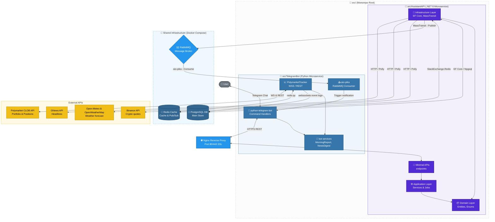

# GEMINI.md — Global Execution Rules & Technical Playbook

> **Role**: Gemini is the **builder and executor**. Gemini writes all code, tests, infrastructure, and automation scripts. 
> All architectural decisions, task breakdowns, and designs are defined in `ARCHITECTURE.md` and `ROADMAP.md`. 
> When in doubt: check the project's documentation first, then ask for clarification — never assume architecture or deviate from the specs.

---

## 🎯 Primary Directive

1. **Read `ARCHITECTURE.md` and `ROADMAP.md` before doing anything** on a new task.
2. **Never deviate from the architecture** defined in `ARCHITECTURE.md` without explicit user instruction.
3. **Always work on the correct branch** as per the Branching Strategy.
4. **Write tests alongside the code** — never leave a feature without comprehensive unit and integration tests.
5. **Keep commits atomic and structured** — one logical change per commit following Conventional Commits.
6. **Deploy and verify** — run local and containerized checks before submitting any work.
7. **100% English Language Standard**: The entire codebase, database tables/columns, schemas, API endpoints, variable names, folder structures, comments, logs, exception messages, and test blocks **must be 100% in English**. The ONLY exception is the user-facing Telegram Bot messages sent to the user, which must be in Brazilian Portuguese (pt-BR).

---

## 🏗️ Technical Stack & Architecture Reference

The **Personal Hub** is a multi-service personal assistant system designed to run 24/7 on a VPS, sending daily morning reports, managing bills/reminders, and tracking real-time market, weather, and Polymarket portfolio data.



### 1. Backend Microservice (`AssistantAPI` - .NET 8)
- **Framework**: `ASP.NET Core 8` (Minimal APIs)
- **Language**: `C# 12`
- **ORM**: `Entity Framework Core 8` with Npgsql (PostgreSQL provider)
- **Design Patterns**: Clean Architecture (Domain → Application → Infrastructure → API), Repository Pattern, Service Layer
- **Job Orchestration**: `Hangfire` (PostgreSQL storage) for scheduled background jobs
- **Resilience**: `Polly` for HTTP retries and circuit breakers
- **Messaging**: `MassTransit` with RabbitMQ provider
- **Validation**: `FluentValidation`
- **Structured Logging**: `Serilog` (Console & File sinks)
- **Testing**: `xUnit` + `FluentAssertions` + `Moq` + `Microsoft.EntityFrameworkCore.InMemory` + `WebApplicationFactory<Program>`

### 2. Bot Microservice (`TelegramBot` - Python 3.12)
- **Framework**: `python-telegram-bot` (v21.x)
- **HTTP Client**: `httpx` (async client)
- **WebSockets**: `websockets` (v12.x) for Polymarket User Channel WSS
- **Queue Consumer**: `aio-pika` (async RabbitMQ client)
- **Cache Client**: `redis-py` (v5.x)
- **Scheduler**: `APScheduler` (v3.10.x) for Cron jobs (Morning Report at 07:00 BRT)
- **NLP Date Parsing**: `dateparser` (v1.2.x) for `/reminder` command
- **Data Validation & Settings**: `pydantic` (v2.x) + `pydantic-settings`
- **Testing**: `pytest` + `pytest-asyncio` + `pytest-mock`

### 3. Infrastructure & Deployment
- **Containerization**: Multi-stage `Dockerfiles` for services + `docker-compose` orchestration
- **Web Server / Reverse Proxy**: `Nginx` with SSL/TLS via Let's Encrypt (`Certbot`)
- **CI/CD**: `GitHub Actions` pipelines (`ci.yml` and `deploy.yml`)
- **Database Backups**: Automated shell script `backup-db.sh` executing nightly pg_dump, stored with 7-day retention

---

## 📂 Project Directory Structure

Every service must map exactly to the monorepo structure outlined below:

```
personal-hub/
├── docker-compose.yml
├── docker-compose.override.yml        # Local development overrides
├── .env.example                       # Template environment file (never commit .env)
├── README.md
├── ARCHITECTURE.md                    # System architecture specification
├── ROADMAP.md                         # Detailed development roadmap
│
├── src/
│   ├── AssistantAPI/                  # .NET 8 Microservice
│   │   ├── AssistantAPI.sln
│   │   ├── AssistantAPI/              # Main API project
│   │   │   ├── Program.cs
│   │   │   ├── appsettings.json
│   │   │   ├── Dockerfile
│   │   │   ├── Domain/                # Entities, Enums, Interfaces
│   │   │   ├── Application/           # Services, DTOs, Validators
│   │   │   ├── Infrastructure/        # DbContext, Migrations, Repositories, Redis Cache, Messaging, Jobs, API Clients
│   │   │   └── Api/                   # Endpoints, Middlewares
│   │   └── AssistantAPI.Tests/        # Unit & Integration Tests (xUnit)
│   │
│   └── TelegramBot/                   # Python Microservice
│       ├── Dockerfile
│       ├── requirements.txt
│       ├── pyproject.toml
│       ├── main.py                    # Entrypoint (starts bot + scheduler + consumer)
│       ├── bot/                       # Command Handlers & Formatters
│       ├── services/                  # ApiClient, MorningReport, NewsDigest, PolymarketTracker
│       ├── consumers/                 # RabbitMQ Alert Consumers
│       ├── scheduler/                 # APScheduler Cron configurations
│       └── tests/                     # Unit & Integration Tests (pytest)
│
├── infra/
│   ├── nginx/
│   │   └── nginx.conf                 # Nginx proxy pass configuration
│   └── scripts/
│       ├── deploy.sh                  # Automation script for server deployments
│       └── backup-db.sh               # DB backup and retention cron script
│
└── .github/
    └── workflows/
        ├── ci.yml                     # Runs linter, formatter checks & tests on every PR
        └── deploy.yml                 # Automated deployment to VPS on main merge
```

---

## 🔀 Git Workflow & Branching Strategy

To keep the repository history pristine and ensure high code quality, we strictly follow this branching and commit strategy.

```
main (Production, Protected)
 └── phase1                      (Phase 1 - Repository & Infrastructure Base)
 └── phase2                      (Phase 2 - .NET Foundation: Bills CRUD)
 └── phase3                      (Phase 3 - Python Bot Foundation)
 └── phase4                      (Phase 4 - Market & Weather Aggregation)
 └── phase5                      (Phase 5 - Morning Report)
 └── phase6                      (Phase 6 - Alerts & RabbitMQ Messaging)
 └── phase7                      (Phase 7 - Polymarket Tracker)
 └── phase8                      (Phase 8 - Testing & Quality)
 └── phase9                      (Phase 9 - VPS Deploy & CI/CD)
 └── phase10                     (Phase 10 - Final Polish & GitHub Portfolio)
```

### Git Action Plan for Each Phase
1. **Always start from the latest main code**:
   ```bash
   git checkout main
   git pull origin main
   git checkout -b phase<number>
   ```
2. **Commit often, commit small**: Commit after every atomic unit of work (e.g. creating an entity, implementing a service method, writing corresponding tests).
3. **Commit Message Standard (Conventional Commits)**:
   - `feat(...)` - a new user-facing feature (e.g., `feat(bills): add mark as paid endpoint`)
   - `fix(...)` - a bug fix (e.g., `fix(redis): correct TTL duration for market quotes`)
   - `test(...)` - adding or updating tests (e.g., `test(alerts): add unit tests for due dispatcher`)
   - `refactor(...)` - changing code structure without changing behavior
   - `chore(...)` - updating configs, dependencies, tool setup, or Dockerfiles
   - `docs(...)` - documentation only (e.g., updates to README or ARCHITECTURE.md)

4. **Pull Requests & Code Merging**:
   - Push your branch to GitHub: `git push origin phase<number>`
   - Open a PR targeting `main`.
   - CI pipeline **must be green** (tests passed, formatting checked, types verified) before merge.
   - Use **Squash and Merge** on GitHub to keep a clean, single-commit history on `main` for each feature phase.

5. **Branch Retention & Lifecycle (MANDATORY)**:
   - To preserve the development history and evolution of each phase in the monorepo, **phase branches must NEVER be deleted** from either the local workspace or the remote GitHub repository.
   - All sub-tasks and increments of a specific phase must be developed sequentially on the corresponding branch (`phase<number>`).

---

## 📝 Code Quality & Standards

### General Standards
- **No Magic Strings or Numbers**: Always use `const`, `static readonly`, or `enums` (e.g., `RedisKeyConventions`, `BillStatus`).
- **No Commented-out Code**: Remove it. Git retains historical versions.
- **No Console Logging**: Always use structured logging with `ILogger<T>` in .NET or Python's `logging` module.
- **No Hardcoded Secrets**: Read all credentials, tokens, and connection strings from environment variables (`.env` or Docker env vars).
- **Asynchronous First**: Use `async`/`await` consistently through both microservices. Never use `.Result` or `.Wait()` in .NET, which causes thread pool starvation.

### .NET (C#) Development Style
- Use **Minimal API** format (e.g. `app.MapBillEndpoints()`) rather than MVC controllers.
- Use **Records** for request/response DTOs:
  ```csharp
  public record CreateBillRequest(string Name, decimal Amount, DateOnly DueDate, string? Notes);
  ```
- **Explicit EF Core Configuration**: Use Fluent API mapping inside `AppDbContext.OnModelCreating`. Do not use lazy loading (`options.UseLazyLoadingProxies(false)`).
- **Service Layer Boundary**: Business logic resides exclusively inside the services (e.g., `BillService`), not in repositories or endpoints.
- **Result Pattern**: Use structural `Result<T>` patterns or standard Web responses rather than throwing domain exceptions for predictable scenarios (like resource not found).
- **Global Exception Handling Middleware**: Trap unhandled errors globally, log the full context (request trace, user context), and return standard `ProblemDetails` responses (RFC 7807) to the client.

### Python Development Style
- Write strict type-annotated code. Enforce type safety using `mypy` check tools.
- Implement **Pydantic v2** models for parsing, serializing, and validating data structures.
- Rely on **Pydantic Settings** (`BaseSettings`) to manage environment configurations reliably.
- Use native async contexts for I/O operations (`httpx.AsyncClient` for REST, `aio_pika` for RabbitMQ, `websockets` for long-lived WSS, `redis.asyncio` for caching).
- Format bot messages using `Markdown V2` and always handle special characters safely.
- Catch all microservice errors gracefully inside Telegram Command Handlers so that the bot never crashes and always replies with a professional, user-friendly error message.

---

## 🗄️ Database & Cache Schema Design

### PostgreSQL Schema
```sql
-- Bills CRUD Table
CREATE TABLE bills (
    id          UUID PRIMARY KEY DEFAULT gen_random_uuid(),
    name        VARCHAR(255) NOT NULL,
    amount      DECIMAL(10,2) NOT NULL,
    due_date    DATE NOT NULL,
    status      VARCHAR(20) NOT NULL DEFAULT 'pending',  -- pending | paid | overdue
    paid_at     TIMESTAMP,
    notes       TEXT,
    created_at  TIMESTAMP NOT NULL DEFAULT NOW(),
    updated_at  TIMESTAMP NOT NULL DEFAULT NOW()
);

-- Reminders & System Alerts Table
CREATE TABLE alerts (
    id           UUID PRIMARY KEY DEFAULT gen_random_uuid(),
    message      TEXT NOT NULL,
    trigger_at   TIMESTAMP NOT NULL,
    status       VARCHAR(20) NOT NULL DEFAULT 'scheduled',  -- scheduled | sent | cancelled
    sent_at      TIMESTAMP,
    created_at   TIMESTAMP NOT NULL DEFAULT NOW()
);

-- Market Snapshot Logs
CREATE TABLE market_snapshots (
    id           UUID PRIMARY KEY DEFAULT gen_random_uuid(),
    symbol       VARCHAR(20) NOT NULL,   -- BTC, USD, GOLD, IBOV...
    price        DECIMAL(20,8) NOT NULL,
    currency     VARCHAR(5) NOT NULL DEFAULT 'BRL',
    source       VARCHAR(50),
    captured_at  TIMESTAMP NOT NULL DEFAULT NOW()
);

-- Polymarket User Positions Snapshot (daily check)
CREATE TABLE polymarket_positions (
    id              UUID PRIMARY KEY DEFAULT gen_random_uuid(),
    market_id       VARCHAR(255) NOT NULL,
    market_question TEXT NOT NULL,
    asset_id        VARCHAR(255) NOT NULL,
    outcome         VARCHAR(10) NOT NULL,   -- YES | NO
    size            DECIMAL(20,6) NOT NULL,
    avg_price       DECIMAL(10,6) NOT NULL,
    current_price   DECIMAL(10,6),
    unrealized_pnl  DECIMAL(20,6),
    status          VARCHAR(20) NOT NULL DEFAULT 'open',  -- open | closed
    snapshotted_at  TIMESTAMP NOT NULL DEFAULT NOW()
);

-- Polymarket User Trade History (WSS event triggered)
CREATE TABLE polymarket_trades (
    id               UUID PRIMARY KEY DEFAULT gen_random_uuid(),
    trade_id         VARCHAR(255) NOT NULL UNIQUE,
    market_id        VARCHAR(255) NOT NULL,
    asset_id         VARCHAR(255) NOT NULL,
    side             VARCHAR(10) NOT NULL,   -- BUY | SELL
    size             DECIMAL(20,6) NOT NULL,
    price            DECIMAL(10,6) NOT NULL,
    fee_rate_bps     INTEGER NOT NULL DEFAULT 0,
    outcome          VARCHAR(10) NOT NULL,
    status           VARCHAR(20) NOT NULL,   -- MATCHED | CONFIRMED | RETRYING
    trader_side      VARCHAR(10),            -- TAKER | MAKER
    transaction_hash VARCHAR(255),
    matched_at       TIMESTAMP NOT NULL,
    created_at       TIMESTAMP NOT NULL DEFAULT NOW()
);

-- Polymarket User Orders Log (WSS event triggered)
CREATE TABLE polymarket_orders (
    id             UUID PRIMARY KEY DEFAULT gen_random_uuid(),
    order_id       VARCHAR(255) NOT NULL UNIQUE,
    market_id      VARCHAR(255) NOT NULL,
    asset_id       VARCHAR(255) NOT NULL,
    side           VARCHAR(10) NOT NULL,   -- BUY | SELL
    outcome        VARCHAR(10) NOT NULL,   -- YES | NO
    original_size  DECIMAL(20,6) NOT NULL,
    size_matched   DECIMAL(20,6) NOT NULL DEFAULT 0,
    price          DECIMAL(10,6) NOT NULL,
    order_type     VARCHAR(10),            -- GTC | GTD | FOK
    status         VARCHAR(20) NOT NULL,   -- LIVE | MATCHED | CANCELLED | EXPIRED
    expiration     TIMESTAMP,
    created_at     TIMESTAMP NOT NULL,
    updated_at     TIMESTAMP NOT NULL DEFAULT NOW()
);
```

### Redis Key Conventions
Every cache query, save, or invalidate action must use the precise keys below:
- `market:crypto:{symbol}` (e.g. `market:crypto:btc`) ➔ Crypto Price Data (TTL: **60s**)
- `market:fx:{pair}` (e.g. `market:fx:usd-brl`) ➔ Exchange rate Data (TTL: **60s**)
- `market:metals:{asset}` (e.g. `market:metals:gold`) ➔ Metals price (TTL: **300s**)
- `weather:current:{city}` (e.g. `weather:current:londrina`) ➔ Current Temp & Conditions (TTL: **600s**)
- `weather:forecast:{city}` (e.g. `weather:forecast:londrina`) ➔ 7-day forecast array (TTL: **1800s**)
- `news:top` ➔ Aggregated top PT-BR finance headlines (TTL: **3600s**)
- `polymarket:portfolio` ➔ User balance, total value, and all-time PnL (TTL: **300s**)
- `polymarket:positions` ➔ Current open positions with current CLOB prices (TTL: **300s**)
- `polymarket:wss:status` ➔ Status indicator (`connected` / `disconnected`) of the websocket tracker (TTL: **60s**)

---

## 🧪 Testing Rules & Coverage Gates

We use a strong Testing Pyramid strategy. Writing test blocks is **mandatory** for every business flow or repository method implemented.

```
         /\
        /  \
       /E2E \     ➔ E2E: Commands executed against local running stack
      /------\
     / Integration\ ➔ Integration: WebApplicationFactory + DbContext (InMemory/TestContainers)
    /--------------\
   /     Unit       \ ➔ Unit: Domain Entities, Business Services, Validators, Formatters
  /__________________\
```

### 1. Test Standards & Naming Patterns
- Test exactly one logical unit of behavior per test method.
- **C# Test Naming**: `MethodName_StateUnderTest_ExpectedBehavior` (e.g., `MarkAsPaid_WhenBillFound_ShouldSetStatusAndPaidAt`).
- **Python Test Standard**: Prefix test files with `test_` and use descriptive async test structures mapped under the `pytest` engine.
- Always mock external dependency layers (e.g., HTTP APIs, Redis caches, RabbitMQ buses) when executing Unit Tests.

### 2. Code Coverage Gates
The CI pipeline (`ci.yml`) will fail if code coverage falls below the following metrics on new components:

| Microservice | Layer / Component | Minimum Target |
| :--- | :--- | :---: |
| **.NET API** | Domain (Entities, Enums) | **95%** |
| | Application (Services, Validators) | **90%** |
| | Infrastructure (Repositories, Jobs) | **75%** |
| | Web / API (Endpoints, Middleware) | **85%** |
| **Python Bot** | Services (ApiClient, NewsDigest) | **90%** |
| | formatters / UI utilities | **90%** |
| | Polymarket Tracker (converters, state) | **80%** |
| | Command Handlers | **75%** |

---

## 🤖 Development Specialists — Agents & Scope

To conduct the project's execution with maximum technical rigor and division of responsibilities, we have a group of **7 Specialized AI Agents** whose rules manuals and guidelines reside in the `.md/` folder.

The main builder (Gemini) will act by assuming the persona of each agent according to the phase of the **`ROADMAP.md`** or the file being manipulated. The table and detailed descriptions below establish the exact correspondence for each step.

> [!IMPORTANT]
> **Language Standards**: The entire project (including codebase, directories, variable names, database schemas, comments, logs, exception messages, and test blocks) **must be 100% in English**. The ONLY exception is the user-facing Telegram Bot messages, which must be in Brazilian Portuguese (pt-BR) to communicate naturally with the end user.

---

### Mapping Table: Agent vs. Roadmap Phase

| Specialized Agent | Rule Manual | Recommended Phase of Action (`ROADMAP.md`) | Allowed Directory Scope |
| :--- | :--- | :--- | :--- |
| 📐 **technical-solution-architect** | [.md/technical-solution-architect.md](file:///c:/Users/Carlos%20Henrique/Desktop/PersonalHub/.md/technical-solution-architect.md) | **Phase 1** (Setup) & Pre-development of all phases | Only documentation and specifications (`.md`, diagrams) |
| 🔍 **technical-researcher** | [.md/technical-researcher.md](file:///c:/Users/Carlos%20Henrique/Desktop/PersonalHub/.md/technical-researcher.md) | **Phases 4, 5, & 7** (Researching API contracts and WebSockets) | Only research reports and comparative diagrams |
| 💻 **dotnet-api-developer** | [.md/dotnet-api-developer.md](file:///c:/Users/Carlos%20Henrique/Desktop/PersonalHub/.md/dotnet-api-developer.md) | **Phases 2, 4, & 6** (API and Database Implementation) | Restricted to `src/AssistantAPI/` (`.cs`, `.csproj`, `.sln`) |
| 🐍 **python-api-developer** | [.md/python-api-developer.md](file:///c:/Users/Carlos%20Henrique/Desktop/PersonalHub/.md/python-api-developer.md) | **Phases 3, 5, 6, & 7** (Bot and WebSocket Implementation) | Restricted to `src/TelegramBot/` (`.py`, `requirements.txt`) |
| 🧪 **qa-engineer** | [.md/qa-engineer.md](file:///c:/Users/Carlos%20Henrique/Desktop/PersonalHub/.md/qa-engineer.md) | **Phase 8** and in parallel across all implementations | Unit/integration test files and test scripts |
| 🛡️ **code-review-expert** | [.md/code-review-expert.md](file:///c:/Users/Carlos%20Henrique/Desktop/PersonalHub/.md/code-review-expert.md) | Mandatory review at the end of each Pull Request | None. Produces code analysis and quality reports only |
| 🎨 **html-css-js-developer**| [.md/html-css-js-developer.md](file:///c:/Users/Carlos%20Henrique/Desktop/PersonalHub/.md/html-css-js-developer.md) | **Phase 10** (Polish and visual layout adjustments) | Static frontend assets (`.html`, `.css`, `.js`) |

---

### Detailed Agent Profiles & Execution Guidelines

#### 1. 📐 [technical-solution-architect.md](file:///c:/Users/Carlos%20Henrique/Desktop/PersonalHub/.md/technical-solution-architect.md)
*   **Core Mission**: Translate business requirements and features described in `ROADMAP.md` into detailed technical component designs, API endpoint contracts, entity modeling, and atomized task checklists for developers.
*   **Boundaries & Constraints**:
    *   ✅ **Allowed**: Create flowcharts, sequence diagrams, technical design documents, and sub-task lists (TODOs).
    *   ❌ **Forbidden**: Write production code, install dependencies, or run build/test commands.

#### 2. 🔍 [technical-researcher.md](file:///c:/Users/Carlos%20Henrique/Desktop/PersonalHub/.md/technical-researcher.md)
*   **Core Mission**: Research and validate technologies, check limits of external APIs (such as Binance API, Open-Meteo, Polymarket CLOB), build comparative library tables, and verify data contracts before development begins.
*   **Boundaries & Constraints**:
    *   ✅ **Allowed**: Make experimental integration API calls, read third-party documentation, and produce research reports.
    *   ❌ **Forbidden**: Implement final services in the codebase or modify infrastructure configuration files.

#### 3. 💻 [dotnet-api-developer.md](file:///c:/Users/Carlos%20Henrique/Desktop/PersonalHub/.md/dotnet-api-developer.md)
*   **Core Mission**: Develop the central API using the .NET 8 C# ecosystem. Ensures strict separation of concerns following Clean Architecture principles.
*   **Strict Technical Guidelines**:
    *   Always use C# 12 Minimal APIs with `record`-based DTOs.
    *   Configure EF Core explicitly using Fluent API in `AppDbContext.OnModelCreating`.
    *   Consistent use of `async`/`await` with mandatory passage of `CancellationToken`.
    *   Data access restricted to the Repository layer; business logic encapsulated entirely within the Service layer.
    *   ❌ **Forbidden**: Perform work outside the `src/AssistantAPI/` directory or modify any Python bot files.

#### 4. 🐍 [python-api-developer.md](file:///c:/Users/Carlos%20Henrique/Desktop/PersonalHub/.md/python-api-developer.md)
*   **Core Mission**: Develop the Telegram Bot, handle commands, maintain persistent WebSocket connections for Polymarket, and process asynchronous messages with RabbitMQ.
*   **Strict Technical Guidelines**:
    *   Write strictly type-annotated code validated using `mypy`.
    *   Implement input and configuration validation using `Pydantic v2` and `Pydantic Settings`.
    *   Always use native async contexts for I/O operations (`httpx.AsyncClient` for REST and `aio-pika` for RabbitMQ).
    *   Ensure graceful global error handling inside Telegram Command Handlers to prevent the bot from crashing.
    *   ❌ **Forbidden**: Directly modify the .NET API or the database without using the REST endpoints exposed by the assistant API.

#### 5. 🧪 [qa-engineer.md](file:///c:/Users/Carlos%20Henrique/Desktop/PersonalHub/.md/qa-engineer.md)
*   **Core Mission**: Design robust test plans and ensure the entire Testing Pyramid (unit tests, integration tests, and coverage validation gates) is met.
*   **Strict Technical Guidelines**:
    *   Write unit tests that verify a single behavior in isolation, fully mocking external dependencies.
    *   Implement realistic C# integration tests using `WebApplicationFactory` and `Microsoft.EntityFrameworkCore.InMemory` or test containers.
    *   Write async Python tests using `pytest` and `pytest-asyncio`.
    *   Monitor and maintain the code coverage gates defined in the playbook.
    *   ❌ **Forbidden**: Modify production code directly to fix bugs — must report the issue and let the respective developer apply the fix.

#### 6. 🛡️ [code-review-expert.md](file:///c:/Users/Carlos%20Henrique/Desktop/PersonalHub/.md/code-review-expert.md)
*   **Core Mission**: Statically analyze codebase quality, adherence to Clean Architecture standards, protection against security vulnerabilities (OWASP, injection), and detect performance bottlenecks.
*   **Strict Technical Guidelines**:
    *   Verify cyclomatic complexity of functions and flag code duplication.
    *   Ensure sensitive data is masked and not logged.
    *   Generate structured Code Review reports with prioritized recommendations (Critical, Important, Minor) before any code is merged into `main`.
    *   ❌ **Forbidden**: Modify repository files or run automated formatters. The role is strictly analytical and advisory.

#### 7. 🎨 [html-css-js-developer.md](file:///c:/Users/Carlos%20Henrique/Desktop/PersonalHub/.md/html-css-js-developer.md)
*   **Core Mission**: Create clean, semantic, and fully responsive user interface components using Vanilla CSS and modern native JavaScript for any auxiliary dashboards.
*   **Strict Technical Guidelines**:
    *   Strictly follow the BEM methodology for naming CSS classes.
    *   Guarantee accessibility (a11y) across all interactive UI elements.
    *   ❌ **Forbidden**: Write backend data persistence logic or introduce heavy framework dependencies without prior validation.

---

## 🚨 Error Handling & Security Checklist

### RFC 7807 Error Responses
All .NET Minimal API endpoints must return standardized errors following the **RFC 7807 Problem Details** format when client errors occur:
- **HTTP 400 Bad Request**: Validation failures. Must return property-specific error keys and array messages.
- **HTTP 401 Unauthorized**: Authentication token missing, expired, or invalid.
- **HTTP 403 Forbidden**: Insufficient scope or permissions.
- **HTTP 404 Not Found**: Entity or route does not exist.
- **HTTP 500 Internal Server Error**: Global unhandled exceptions. Must log complete trace info and return a generic error message without exposing core stack traces to the public.

### Security Implementation Checklist
- [ ] **Input Validation**: Validate every single incoming request with `FluentValidation` (.NET) or `Pydantic` (Python) before starting any business execution.
- [ ] **No Secret Exposures**: Sensitive details like passwords, API keys, and connection strings must be read strictly from `Configuration` / Environment variables. Ensure `.env` is listed inside `.gitignore` and never committed.
- [ ] **SQL Injection Prevention**: Rely fully on EF Core parameterized commands or LINQ queries. Never concatenate SQL strings.
- [ ] **Polly Resilience**: Apply HTTP retry policies with exponential backoff and Jitter to all external outbound connections.
- [ ] **RabbitMQ Dead Letter Queue**: Configure a DLQ (`telegram.alerts.error`) for failed message deliveries so that no notifications are lost silently on transient broker outages.
- [ ] **Rate Limiting**: Apply basic rate-limiting middleware to all public-facing API routes inside `AssistantAPI`.

---

## 📊 Documentation Responsibilities

After completing any development session, the developer must:
1. **Log Metrics**: Update the project metrics and logs table, including:
   - Number of atomic commits executed.
   - Tests created and successfully verified (Unit / Integration / E2E).
   - Net lines of code written/modified.
2. **Task Board Progression**: Check off completed items in `ROADMAP.md` or the corresponding plan files with a clear `[x]` tag.
3. **Commit the Doc Updates**: Log the tracking update with a clear, conventional commit: `docs: update roadmap metrics and task status`.

---

*This playbook governs all agent behaviors for the Personal Hub project. Follow it without exception.*
*Last updated: May 2026*
